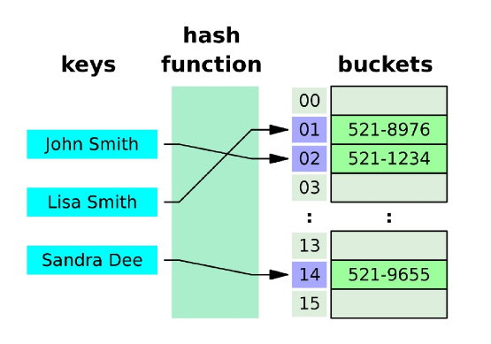

# 메서드

## 비시퀀스 데이터 구조 - 딕셔너리 메서드
|메서드|설명|
|:----:|----|
|d.clear()|모든 키/값 쌍을 제거|
|**d.get(k[, v])**|**키 k에 연결된 값을 반환하고 키가 없으면 None을 반환 (혹은 기본 값 v를 반환)**|
|**d.keys()**|**키를 모은 객체를 반환**|
|**d.values()**|**값을 모은 객체를 반환**|
|**d.items()**|**키/값 쌍을 모은 객체를 반환**|
|**d.pop(k[, v])**|**키 k를 제거하고 연결됐던 값을 반환하고 없으면 오류 (혹은 기본 값 v를 반환)**|
|d.setdefault(k[, v])|키 k와 연결된 값을 반환 (키 k가 존재하지 않을 경우 값 v와 연결된 키 k를 추가하고 v를 반환)|
|d.update([other])|다른 딕셔너리 other 내 각 키에 대해 d에 있는 키면 d에 있는 그 키의 값을 other에 있는 값으로 대체 (other에 있는 각 키에 대해 d에 없는 키면 키/값 쌍을 d에 추가)|

### .clear()
```python
person = {'name': 'Alice', 'age': 25}
person.clear()

print(person) # {}
```

### .get(key[, default])
```python
person = {'name': 'Alice', 'age': 25}

print(person.get('name')) # Alice
print(person.get('country')) # None
print(person.get('country', 'Unknown')) # Unknown
print(person['country']) # KeyError: 'country'
```
- `d.get(key)`는 해당 key가 없을 경우 None이나 기본 값을 반환하지만 `d[key]`는 해당 key가 없을 경우 KeyError가 발생한다.

### .keys()
```python
person = {'name': 'Alice', 'age': 25}

print(person.keys()) # dict_keys(['name', 'age'])

for key in person.keys():
    print(key)
'''
name
age
'''
```
- dict_keys는 고유한 타입이고 시퀀스형 데이터타입으로 생각하여 for문을 이용한 순회가 가능하다.

### .values()
```python
person = {'name': 'Alice', 'age': 25}

print(person.values()) # dict_values(['Alice', 25])

for value in person.values():
    print(value)
'''
Alice
25
'''
```

### .items()
```python
person = {'name': 'Alice', 'age': 25}

print(person.items()) # dict_items([('name', 'Alice'), ('age', 25)])


for item in person.items():
    print(item)
'''
('name', 'Alice')
('age', 25)
'''

# 위에 것은 tuple 형태로 출력되어 활용하기 불편하므로 다음과 같이 언패킹을 해준다.
for key, value in person.items():
    print(key, value)
'''
name Alice
age 25
'''
# 이 방법 굉장히 중요
```
- 파이썬은 자동으로 키/값 쌍을 tuple로 묶는데 이를 언패킹 해주면 키와 값을 각각 불러낼 수 있다.

### .pop(key[, default])
```python
person = {'name': 'Alice', 'age': 25}

print(person.pop('age')) # 25
print(person) # {'name': 'Alice'}
print(person.pop('country', None)) # None
print(person.pop('country')) # KeyError: 'country'
```
- 리스트의 `.pop(i)`에서는 없애기를 원하는 값의 인덱스를 넣어야 하지만 딕셔너리는 인덱스 같은 것이 존재하지 않으므로 지우기를 원하는 key 값 자체를 넣어야 한다.

### .setdefault(key[, default])
```python
person = {'name': 'Alice', 'age': 25}

print(person.setdefault('country', 'Korea')) # Korea
print(person) # {'name': 'Alice', 'age': 25, 'country': 'Korea'}
```
- `.setdefault`는 몰라도 지장은 없지만 그 자체에 if문을 포함하고 있는 함수이기 때문에 유용하다.

### .update([other])
```python
person = {'name': 'Alice', 'age': 25}
other_person = {'name': 'Jane', 'gender': 'Female'}

person.update(other_person)

print(person) # {'name': 'Jane', 'age': 25, 'gender': 'Female'}

person.update(age=50, country='Korea')

print(person) # {'name': 'Jane', 'age': 50, 'gender': 'Female', 'country': 'Korea'}
```
- `.update`에서 [other]에는 또 다른 딕셔너리를 인자로 넣을 수도 있고 키/값 쌍을 인자로 넣을 수도 있다.

> 이 외의 다양한 딕셔너리 메서드는 공식문서를 참고할 수 있다.
>
> [파이썬 공식문서 딕셔너리 메서드 부분]('https://docs.python.org/3/library/stdtypes.html#dict')


## 비시퀀스 데이터 구조 - 세트 메서드
|메서드|설명|
|:----:|----|
|**s.add(x)**|**항목 x를 추가 (이미 x가 있다면 변화 X)**|
|s.clear()|모든 항목을 제거|
|**s.remove(x)**|**항목 x를 제거 (항목 x가 없을 경우 오류)**|
|s.pop()|임의의 항목을 반환하고 해당 항목을 제거|
|s.discard(x)|항목 x를 제거|
|s.update(iterable)|다른 iterable 요소를 추가|

### .add(x)
```python
my_set = {'a', 'b', 'c', 1, 2, 3}
my_set.add(4)

print(my_set) # {1, 2, 3, 'a', 4, 'b', 'c'}
```

### .clear()
```python
my_set = {'a', 'b', 'c', 1, 2, 3}
my_set.clear()

print(my_set) # set()
```

### .remove(x)
```python
my_set = {'a', 'b', 'c', 1, 2, 3}
my_set.remove(2)

print(my_set) # {'b', 1, 3, 'a', 'c'}

my_set.remove(10)

print(my_set) # KeyError: 10
```
- 지우고자 하는 항목 x가 없을 경우 KeyError가 발생한다.

### .pop()
```python
my_set = {'a', 'b', 'c', 1, 2, 3}

element=my_set.pop()

print(element) # b (임의의 요소 반환)
print(my_set) # {1, 2, 3, 'c', 'a'}
```
- **임의의** 요소라는 말이 파이썬에서는 굉장히 오묘한데 이는 뒤에서 해쉬함수로 알아보자.
    - '임의의'라고 했지만 완전한 랜덤이 아니라는 것을 확인할 수 있다.

### .discard()
```python
my_set = {'a', 'b', 'c', 1, 2, 3}
my_set.discard(2)

print(my_set) # {1, 3, 'a', 'b', 'c'}

my_set.discard(10)

print(my_set) # {1, 3, 'a', 'b', 'c'}
```
- `.remove`와 유사하지만 `.remove`와 달리 지우려는 요소가 없어도 에러가 나지 않는다.

### .update(iterable)
```python
my_set = {'a', 'b', 'c', 1, 2, 3}
my_set.update([1, 4, 5])

print(my_set) # {1, 2, 3, 4, 5, 'a', 'b', 'c'}
```

## 비시퀀스 데이터 구조 - 세트의 집합 메서드
|메서드|설명|연산자|
|:----:|----|:----:|
|set1.difference(set2)|set1에는 들어있지만 set2에는 없는 항목으로 세트를 생성 후 반환|set1 - set2|
|set1.intersection(set2)|set1과 set2 모두 들어있는 항목으로 세트를 생성 후 반환|set1 & set2|
|set1.issubset(set2)|set1의 항목이 모두 set2에 들어있으면 True를 반환|set1 <= set2|
|set1.issuperset(set2)|set1이 set2의 항목을 모두 포함하면 True를 반환|set1 >= set2|
|set1.union(set2)|set1 또는 set2에(혹은 둘 다) 들어있는 항목으로 세트를 생성 후 반환|이건 연산자 못 쓰겠다|

```python
set1 = {0, 1, 2, 3, 4}
set2 = {1, 3, 5, 7, 9}
set3 = {0, 1}

print(set1.difference(set2)) # {0, 2, 4}
print(set1.intersection(set2)) # {1, 3}
print(set1.issubset(set2)) # False
print(set3.issubset(set1)) # True
print(set1.issuperset(set2)) # False
print(set1.union(set2)) # {0, 1, 2, 3, 4, 5, 7, 9}
```

# 해시 테이블 (Hash Table)
- 해시 함수를 사용하여 변환한 값을 색인(index)로 삼아 키(key)와 데이터(value)를 저장하는 자료구조
- 데이터를 효율적으로 저장하고 검색하기 위해 사용

## 원리
- 키를 해시 함수를 통해 해시 값으로 변환하고 이를 인덱스로 사용하여 데이터를 저장하거나 검색


### 해시 (Hash)
- 임의의 크기를 가진 데이터를 고정된 크기의 고유한 값(정수형태)으로 변환하는 것
    - 해당 데이터를 식별하는 "지문"같은 역할을 한다.
- 파이썬에서는 해시 함수를 사용하여 데이터를 해시 값으로 변환하며 이는 정수로 표현된다.

### 해시 함수 (Hash function)
- 임의의 길이의 데이터를 입력 받아 해시 값을 출력하는 함수
- 해시 함수가 데이터를 변환하는 방법은 파이썬을 재실행할 때마다 변경된다.
- 파이썬에서 해시 함수의 동작 방식은 객체의 타입에 따라 달라진다.
- 매우 빠른 데이터 검색을 위한 소프트웨어에서 유용하게 사용한다.

## set의 요소 & dictionary의 키와 해시테이블 관계
- 파이썬에서 세트의 요소와 딕셔너리의 키는 해시 테이블을 이용하여 중복되지 않는 고유한 값을 저장한다.
    - 해시 함수를 통해 해시 값으로 변환되고 이를 기반으로 해시 테이블에 저장

### set의 pop 메서드 - 정수
```python
my_set = {3, 2, 1, 9, 100, 4, 87, 39, 10, 52}
print(my_set.pop()) # 1
print(my_set.pop()) # 2
print(my_set.pop()) # 3
print(my_set.pop()) # 100
print(my_set.pop()) # 4
print(my_set.pop()) # 39
print(my_set.pop()) # 9
print(my_set.pop()) # 10
print(my_set.pop()) # 52
print(my_set.pop()) # 87
print(my_set) # set()
```
위의 코드는 몇 번을 돌려도 똑같은 순서로 `.pop()`이 되고 값이 반환이 된다. 분명 `.pop()`은 **임의의 값**을 반환하고 제거한다고 했는데 왜일까?
- 파이썬에서는 정수 값 자체가 곧 해시 값이다. 따라서 같은 정수는 항상 같은 해시 값을 가진다.
- .pop()은 해시 테이블에 나타나는 순서대로 반환이 되고 우리가 보는 반환되는 순서는 즉 정수가 가진 고유의 해시 값이 테이블에 저장되어 있는 순서인 것이다.
- 정수의 해시 값은 매번 달라지는 해시 함수와는 관련이 없는 값이기 때문에 파이썬을 재실행해도 바뀌지 않는다.
    - 엄밀히 말하면 정수의 해시 함수는 그냥 정수 스스로를 그대로 리턴하는 함수이다.
- 따라서 코드를 몇 번이고 돌려도 똑같은 순서로 `.pop()`이 되는 것이다.
- **그러나 이것이 set이 순서를 갖고 있다는 것은 아니다. `.pop()`이 작동하는 순서만 존재하지 set이라는 자료구조 자체가 순서를 가지고 있지는 않다.**

### set의 pop 메서드 - 문자열
```python
my_str_set = {'a', 'b', 'c', 'd', 'e', 'f', 'g', 'h', 'i', 'j'}
print(my_str_set.pop()) # i  # b
print(my_str_set.pop()) # d  # i
print(my_str_set.pop()) # b  # c
print(my_str_set.pop()) # h  # d
print(my_str_set.pop()) # a  # e
```
위의 코드는 정수와는 다르게 돌릴 때마다 다른 순서로 `.pop()`이 된다. 왜일까?
- 문자열의 경우 다양한 길이를 갖고 있고 문자열에 포함된 각 문자들의 유니코드 코드 포인트 등을 기반으로 해시 값을 계산한다.
    - 간단히 말해서 문자열은 해시 함수로 인해 해시 값을 지정받는 데이터 타입이다.
- 앞에서 말했듯이 해시 함수는 파이썬을 재실행할 때마다 바뀌기 때문에 코드를 재실행 할 때마다 결과가 달라지는 것이다.

## hashable
- `hash()` 함수의 인자로 전달해서 결과를 반환 받을 수 있는 객체
    - `hash()`: 자료의 해시 값을 반환하는 함수
- 대부분의 불변형 데이터 타입은 hashable
    - 불변 객체는 해시 값이 변하지 않으므로 동일한 값에 대해 일관된 해시 값을 유지할 수 있다.
    - 단 `tuple`의 경우 불면형이지만 해시 불가능한 객체를 참조할 때는 `tuple` 자체도 해시 불가능해진다.
        - ex. `(1, 2, [3, 4])`
- 가변형 객체는 값이 변경될 수 있기 때문에 동일한 객체에 대한 해시 값이 변경될 가능성이 있고, 같은 객체에 대한 서로 다른 해시 값이 반환될 수 있기 때문에 hashable 하지 않다.
    - 해시 테이블의 무결성, 해시 값의 일관성 유지 불가

> hashable 객체는 해시 테이블 기반 자료인 set과 dict의 key를 사용할 때 중복 값을 방지하고 빠른 검색과 조회를 가능하게 한다.

# 파이썬 문법 규격
## BNF (Backus-Naur Form)
- 프로그래밍 언어의 문법을 표현하기 위한 표기법

## EBNF (Extended Backus-Naur Form)
- BNF를 확장한 표기법
- 메타 기호를 추가하여 더 간결하고 표현력이 강해진 형태
### 대표적인 EBNF 메타기호
|메타 기호|의미|
|:----:|:----:|
|[]|선택적 요소|
|{}|0번 이상 반복|
|()|그룹화|

> 서로 다른 프로그래밍 언어, 데이터 형식, 프로토콜 등의 문법을 통일하여 정의하기 위해 BNF와 같은 표기법을 사용한다.
