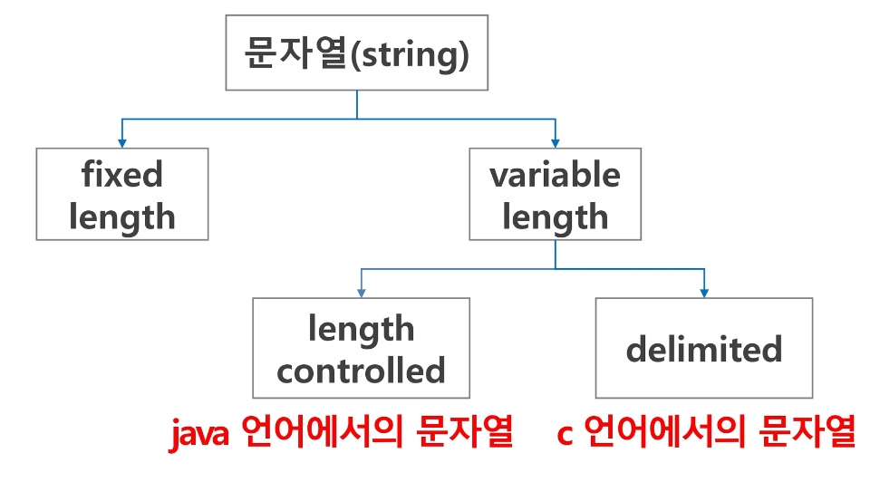

# 알고리즘
- 유한한 단계를 통해 문제를 해결하기 위한 절차나 방법
- 알고리즘은 다음과 같은 요소로 얼마나 좋은 알고리즘인지 판단한다.
    1. 정확성: 얼마나 정확하게 동작하는가
    2. 작업량: 얼마나 적은 연산으로 원하는 결과를 얻어내는가
    3. 메모리 사용량: 얼마나 적은 메모리를 사용하는가
    4. 단순성: 얼마나 단순한가
    5. 최적성: 더 이상 개선할 여지 없이 최적화되었는가

## 시간 복잡도 (Time Complexity)
- 알고리즘의 작업량을 표현하는 방법
- 실제 걸리는 시간을 측정하거나 실행되는 명령문의 개수를 계산한다.
- 보통 **빅-오(O) 표기법**으로 나타낸다.

### 빅-오(O) 표기법
- 시간 복잡도 함수 중에서 가장 큰 영향력을 주는 n에 대한 항만을 표시 (계수는 생략)
```python
def CalcSum(n):
    sum=0 # 1번
    for i in range(1, n+1): # n번
        sum+=i # n번
    return sum
```
위의 알고리즘은 `2n+1`의 시간 복잡도를 가지고 있지만 빅-오 표기법으로 나타내면 `O(n)`의 시간 복잡도를 가지고 있다.

# 배열
- 일정한 자료형의 변수들을 하나의 이름으로 열거하여 사용하는 자료구조
- 하나의 선언을 통해서 둘 이상의 변수를 선언할 수 있으며 다수의 변수로는 하기 힘든 작업을 배열을 활용해 쉽게 할 수 있다.

> 입력받은 정수를 1차원 배열 혹은 각각의 변수에 저장하는 방법
> 
> ```python
> arr=list(map(int, input().split()))
> a, b=map(int, input().split())
> ```

> 알고리즘은 기본적으로 문제를 풀기 위해 접근하는 방식이 중요하다. 처음 방식을 잘 생각해내면 그 이후 코드는 자연스럽게 작성이 되기 때문에 처음부터 코드를 작성하려고 하지 말고 천천히 종이에 써가면서 문제 풀이 방식을 고안해보자.

# 정렬
- 2개 이상의 자료를 특정 기준에 의해 작은 값부터 큰 값(오름차순), 혹은 그 반대의 순서대로(내림차순) 재배열하는 것
- 버블 정렬, 카운팅 정렬, 선택 정렬, 퀵 정렬, 삽입 정렬, 병합 정렬

## 버블 정렬 (Bubble Sort)
- 인접한 두 개의 원소를 비교하며 자리를 계속 교환하는 방식
- 첫 번째 원소부터 인접한 원소끼리 계속 자리를 교환하면서 맨 마지막 자리까지 이동하며 한 단계가 끝나면 가장 큰 원소가 마지막 자리로 정렬된다.
- O(n^2)의 시간 복잡도

### [55, 7, 78, 12, 42]를 버블 정렬하는 과정 (오름차순)
#### 첫 번째 패스

#### 두 번째 패스

#### 세 번째 패스

#### 네 번째 패스 (정렬 끝)


#### 코드로 구현
```python
def BubbleSort(arr, N): # 정렬할 List, N 원소 수
    for i in range(N-1, 0, -1): # 범위의 끝 위치
        for j in range(0, i): # 비교할 왼쪽 원소
            if a[j]>a[j+1]:
                a[j], a[j+1] = a[j+1], a[j] # 왼쪽이 오른쪽보다 클 경우 위치를 바꾼다.
```