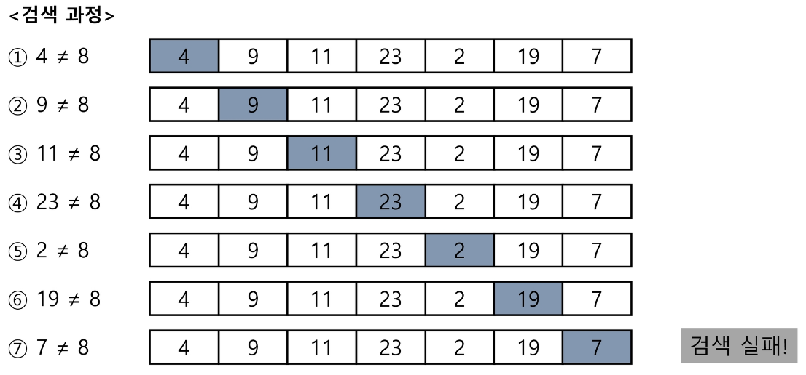
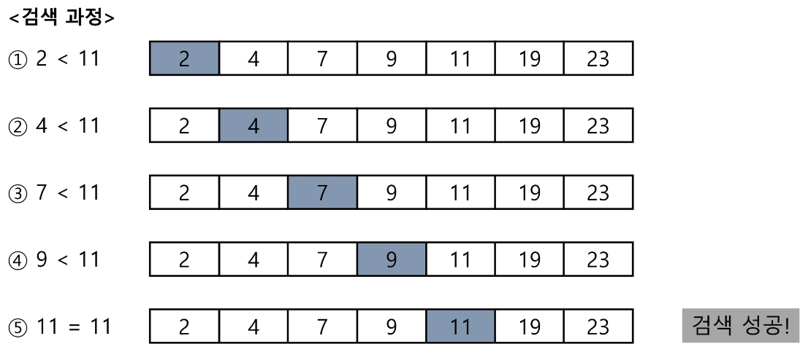
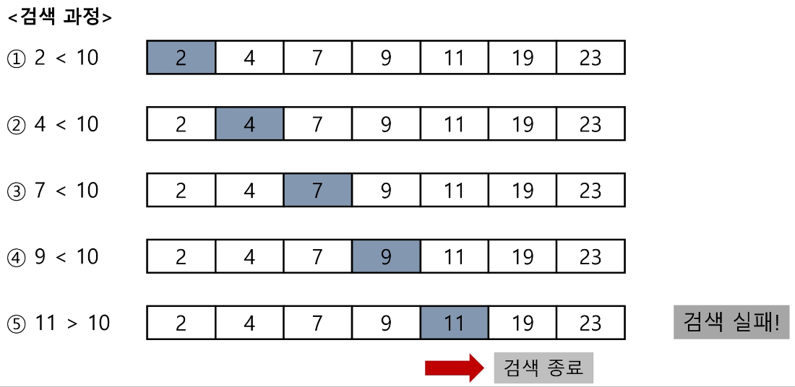
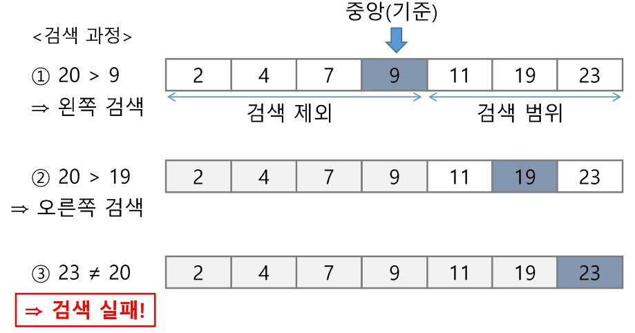

# 검색
- 저장되어 있는 자료 중에서 원하는 항목을 찾는 작업
- 목적하는 탐색 키를 가진 항목을 찾는 것
    - 탐색 키(search key): 자료를 구별하여 인식할 수 있는 키
- 순차 검색, 이진 검색, 해쉬

## 순차 검색
- 일렬로 되어 있는 자료를 순서대로 검색하는 방법
- 순차구조로 구현된 자료구조에서 유용
- 알고리즘이 단순하고 구현이 쉽지만 검색 대상의 수가 많은 경우 비효율적

### 정렬되어 있지 않는 자료의 순차 검색
#### 검색 과정
- 첫 번째 원소부터 순서대로 검색 대상과 키 값이 같은 원소가 있는지 비교하며 찾기
- 키 값이 동일한 원소를 찾으면 그 원소의 인덱스를 반환
- 자료의 마지막에 이를 때까지 검색 대상을 찾지 못하면 검색 실패
- count 함수를 직접 구현할 때 사용하던 방법인 듯

<2를 검색하는 과정>


<8을 검색하는 과정(자료에 존재 X)>


#### 특징
- 찾고자 하는 원소의 순서에 따라 비교회수가 결정된다.
    - 평균 비교 횟수: (n+1)/2 -> O(n)의 시간 복잡도

#### 코드 구현
```python
# for문으로 구현
def sequential_search(list, key):

    for i in range(len(list)):
        if list[i] == key:
            return i
    
    return -1

list = [4, 9, 11, 23, 2, 19, 7]
print(sequential_search(list, 2))    # 4
```
```python
# while문으로 구현
def sequential_search(list, key):

    i = 0
    while i < len(list) and list[i] != key:
        i += 1
    if i < len(list):
        return i
    
    return -1

list = [4, 9, 11, 23, 2, 19, 7]
print(sequential_search(list, 2))    # 4
```

### 정렬되어 있는 자료의 순차 검색
#### 검색 과정 (오름차순 정렬 상태)
- 자료를 순차적으로 검색하면서 키 값을 비교하는데 원소의 키 값이 검색 대상의 키 값보다 크면 찾는 원소가 없다는 것이므로 더 이상 검색하지 않고 종료
    - 기본적으로 키 값과 원소를 직접 비교하는 것은 맞지만 정렬되지 않은 경우에는 자료의 끝까지 검색을 해야 원하는 키 값이 존재하지 않는다는 것을 알게 되지만 오름차순 정렬이 되어 있는 경우 찾으려는 키 값보다 탐색하는 원소의 키 값이 커질 경우 더 조사를 해도 의미가 없고 원하는 키 값이 없다는 것을 의미하므로 그 순간에 바로 검색을 종료할 수 있다.

<11을 검색하는 경우>


<10을 검색하는 경우(자료에 존재 X)>


#### 특징
- 찾고자 하는 원소의 순서에 따라 비교회수가 결정된다.
    - 정렬이 되어 있기 때문에 정렬 되어 있지 않은 경우보다 비교 회수가 절반 정도이다.
    - 그러나 주어진 자료를 정렬하는 시간도 들기 때문에........
    - O(n)의 시간 복잡도

#### 코드 구현
```python
# for문으로 구현
def sequential_search(list, key):

    for i in range(len(list)):
        if list[i] == key:
            return i
        elif list[i] > key:
            return -1

list = [2, 4, 7, 9, 11, 19, 23]
print(sequential_search(list, 11))    # 4
```
```python
# while문으로 구현
def sequential_search(list, key):

    i = 0
    
    while i < len(list) and list[i] < key:
        i += 1
    if i < len(list) and list[i] == key:
        return i
    else:
        return -1

list = [2, 4, 7, 9, 11, 19, 23]
print(sequential_search(list, 11))    # 4
```

## 이진 검색
- 자료의 가운데에 있는 항목의 키 값과 비교하여 다음 검색의 위치를 결정하고 검색을 계속 진행하는 방법
- 이진 검색을 하기 위해서는 **자료가 정렬된 상태**여야 한다.
    - 자료의 삽입이나 삭제가 발생했을 때 배열의 상태를 항상 정렬 상태로 유지하는 추가 작업이 필요하다.

<7을 검색하는 경우>


<20을 검색하는 경우>


### 코드 구현
```python
def binary_search(list, key):

    start = 0
    end = len(list)-1

    while start <= end:
        middle = (start+end)//2
        if key == list[middle]:
            return middle
        elif key < list[middle]:
            end = middle-1
        else:
            start = middle+1
    
    return -1

list = [2, 4, 7, 9, 11, 19, 23]
print(binary_search(list, 11))    # 4
```

> **인덱스**
> 
> DB에서 유래한 테이블에 대한 동작 속도를 높여주는 자료 구조.
>
> 대량 데이터의 성능 저하 문제를 해결하기 위해 배열 인덱스를 사용할 수 있다.
>
> DB 인덱스는 이진 탐색 트리 구조로 되어 있다.

# 정렬
## 선택 정렬
- 주어진 자료들 중 가장 작은 값의 원소부터 차례대로 선택하여 위치를 교환하는 방식
- 주어진 리스트 중에서 최소값을 찾고 그 값을 리스트의 첫번째 요소와 교환하는 것을 반복한다.
- O(n^2)의 시간 복잡도

### [64, 25, 10, 22, 11]을 선택 정렬하는 과정

#### 1단계
- 주어진 리스트에서 최소값을 찾는다.
- 결국 뒤에 가서는 인덱스를 이용하여 최소값과 첫번째 요소의 위치를 바꿔야 하기 때문에 최소값을 찾을 때도 인덱스를 이용하여 접근하는 것이 좋다.


#### 2단계
- 리스트의 맨 앞에 위치한 값과 교환한다.
- 인덱스를 이용한다.


#### 3단계
- 미정렬 리스트에 대해 1단계와 2단계를 반복한다.
- 미정렬 원소가 하나 남은 상황에서는 마지막 원소가 가장 큰 값을 갖게 되므로 실행을 종료하고 선택 정렬이 완료된다.

#### 코드 구현
```python
def selection_sort(list):
    
    for i in range(len(list)-1):    # 범위가 len(list)-1인 이유는 미정렬 원소가 하나 남은 상황에서는 굳이 기준 위치를 잡을 필요가 없기 때문
        min_index = i    # 최소값을 갖고 있는 요소의 인덱스가 우선 기준 원소(미정렬 리스트의 제일 첫번째 원소)의 인덱스라고 가정
        for j in range(i+1, len(list)):    # 범위가 i+1부터 시작하는 이유는 기준 원소 앞쪽의 리스트는 정렬된 리스트이기 때문에 고려할 필요 X
            if list[j] < list[min_index]:
                min_index = j    # 실제 최소값이 들어있는 요소의 인덱스를 찾는 과정
        list[i], list[min_index] = list[min_index], list[i]    # 최소값의 위치와 기준 원소의 위치를 바꾸기

    print(list)

list = [10, 25, 64, 22, 11]
select_sort(list)    # [10, 11, 22, 25, 64]
```

### 셀렉션 알고리즘(Selection Algorithm)
- 저장되어 있는 자료로부터 k번째로 큰 혹은 작은 원소를 찾는 방법
- 자료 정렬하기 -> 원하는 순서에 있는 원소 가져오기

#### k번째로 작은 원소를 찾는 알고리즘
- k가 비교적 작을 때 유용하며 O(kn)의 시간 복잡도
```python
def select(list, k):
    
    for i in range(0, k):    # 범위가 k까지인 이유는 k번째로 작은 원소만 찾으면 되기 때문
        min_index = i
        for j in range(i+1, len(list)):
            if list[min_index] > list[j]:
                min_index = j
        list[min_index], list[i] = list[i], list[min_index]
    
    return list[k-1]

list = [10, 25, 64, 22, 11]
print(select(list, 4))    # 25
```

