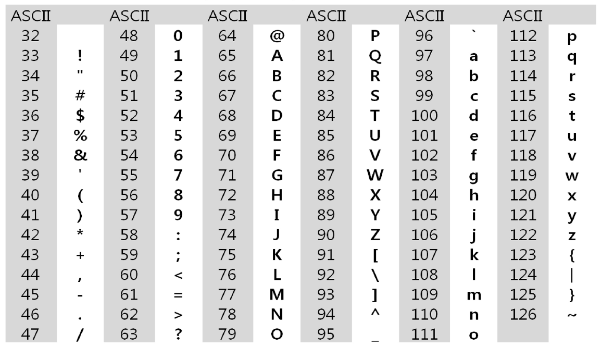
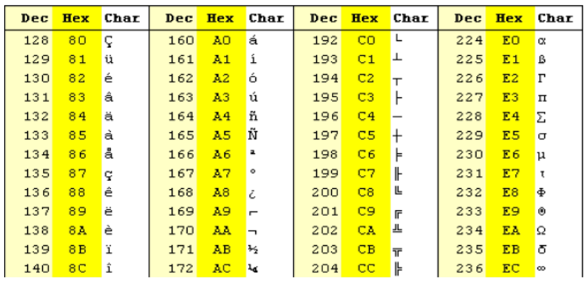
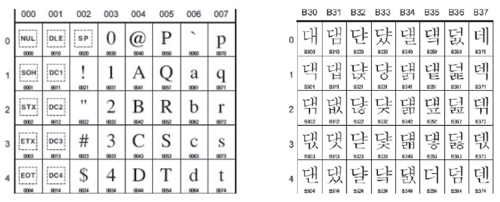
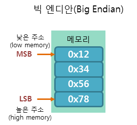
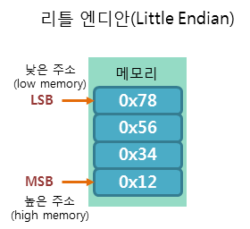
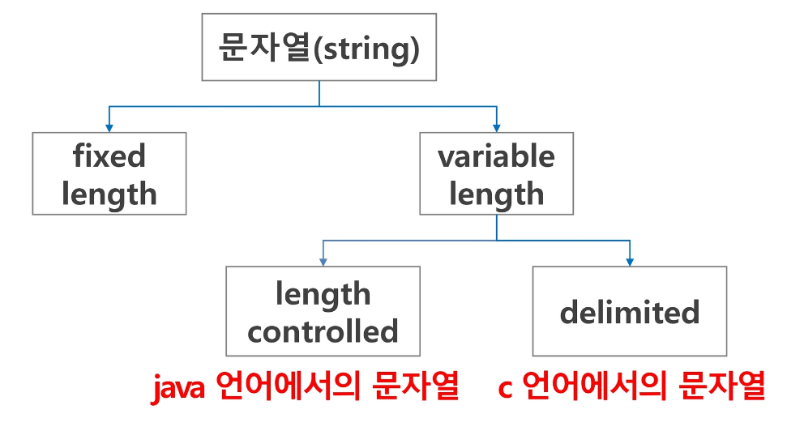
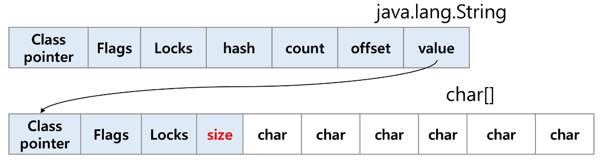

# 문자의 표현
- 컴퓨터는 문자를 저장할 때 각 문자에 대응되는 숫자를 정해놓고 이것을 메모리에 저장한다.
    - 이를 코드체계라고 한다.
- 네트워크의 발달로 공통된 코드체계가 필요하게 되었고 `ASCⅡ`라는 문자 인코딩 표준이 제정되었다.

## ASCⅡ (아스키)
- 7-bit 인코딩으로 128문자를 표현
    - 33개의 출력 불가능한 제어 문자
    - 95개의 출력 가능한 문자
- 오늘날 대부분의 컴퓨터가 문자를 읽고 쓰는데 사용하는 형식

## 확장 아스키
- 부가적인 문자를 128개 추가할 수 있게 하는 부호
- 1 Byte 내의 8-bit를 모두 사용
- 표준 아스키와 달리 프로그램이나 컴퓨터 또는 프린터가 그것을 해독할 수 있도록 설계되어 있어야 한다.

> 컴퓨터가 발전하면서 각 국가들은 자국의 문자를 표현하기 위하여 자체적인 코드체계를 만들어서 사용하게 되었다.

## 유니코드
- 자국의 코드체계를 타 국가가 가지고 있지 않는 경우 정보를 잘못 해석할 수 있다.
- 다국어 처리를 위한 표준

- UCS-2(Universal Character Set 2)와 UCS-4(Universal Character Set 4)로 분류
    - 유니코드를 저장하는 변수의 크기를 정의
    - 파일을 인식할 때는 이 파일이 USC-2인지 UCS-4인지 인식하고 각 경우를 구분해서 모두 다르게 구현해야 한다.
        - 이를 편하게하기 위해 유니코드의 적당한 외부 인코딩 필요

### big-endian, little-endian
#### big-endian
- 낮은 주소에 데이터의 높은 바이트부터 저장하는 방식
- 평소 우리가 숫자를 사용하는 선형 방식과 동일

#### little - endian
- 낮은 주소에 데이터의 낮은 바이트부터 저장하는 방식
- 선형 방식과 거꾸로 읽어야 한다.

# 문자열

## String 클래스에 대한 메모리 배치
### java
- java.lang.String 클래스
- 기본적인 객체 메타 데이터 외에도 hash(hash값), count(문자열의 길이), offset(문자열 데이터의 시작점), value(실제 문자열 배열에 대한 참조)필드 들이 포함되어 있다.

## 다양한 컴퓨터 언어 별 문자열 처리
### C 언어
- 문자들의 배열 형태로 구현된 응용 자료형
- 문자 배열에 문자열을 저장할 때는 항상 마지막에 끝을 표시하는 널문자('\0')을 넣어줘야 한다.
    - `char ary[] = {'a', 'b', 'c', '\0'}`
    - `char ary[] = 'abc'`
- 문자열 처리에 필요한 연산을 함수 형태로 제공한다.
    - `strlen()`, `strcpy()`, `strcmp()`, ...
- 아스키 코드로 저장
- 문자열 비교를 위한 `strcmp()` 함수 제공
- 문자열 숫자를 정수로 변환하는 `atoi()` 함수 제공

### java
- 문자열 데이터를 저장, 처리해주는 `String` 클래스 제공
    - `String str = 'abc'`
    - `String str = new String('abc')`
- 문자열 처리에 필요한 연산을 연산자, 메소드 형태로 제공
    - `+`, `length()`, `split()`, `substring()`, ...
- 유니코드(UTF16, 2byte)로 저장
- 문자열 비교를 위한 `equals()` 메소드 제공
- 문자열 숫자를 정수로 변환하는 `parse` 메소드 제공

### python
- char 타입이 없고 텍스트 데이터의 취급방법이 통일되어 있다.
- 시퀀스 자료형으로 분류
    - 시퀀스 자료형에서 사용할 수 있는 인덱스, 슬라이싱 연산들을 사용할 수 있다.
- `replace()`, `split()`, `isalpha()`, `find()`, ...
- 요소값을 변경할 수 없다.
- 유니코드(UTF8)로 저장
- 문자열 비교를 위한 `==` 연산자와 `is` 연산자 제공
    - `==`는 값 자체만 비교, `is`는 메모리 주소까지 비교
- 문자열 숫자를 정수로 변환하는 `int`, `float` 등의 형변환 함수 제공

