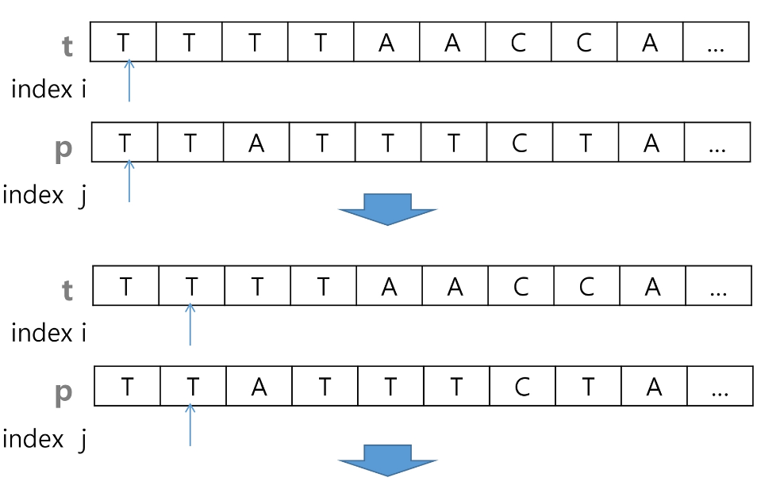
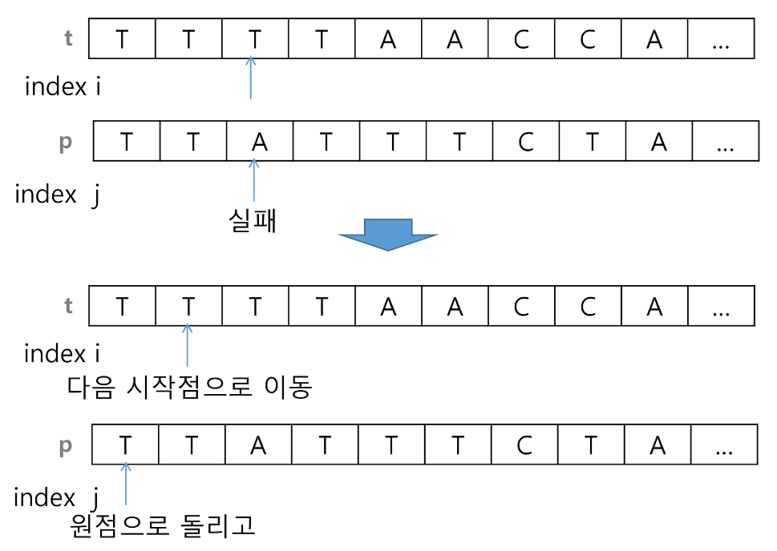

# 패턴 매칭
- 데이터를 검색할 때 특정 패턴이 출현하는지, 또한 어디에 출현하는지 등을 특정하는 방법의 일종
- 문자열의 패턴 매칭은 문자열 검색 알고리즘의 일종
- 고지식한 패턴 검색 알고리즘, 카프-라빈 알고리즘, KMP 알고리즘, 보이어-무어 알고리즘

## 고지식한 알고리즘 (Brute Force)
- 문자열을 처음부터 끝까지 차례대로 순회하면서 패턴 내의 문자들을 일일이 비교
- 텍스트의 모든 위치에서 패턴을 비교해야 하므로 최악의 시간복잡도는 O(M*N)
    - M은 찾으려는 텍스트의 길이, N은 전체 텍스트의 길이
    - 시간 복잡도가 너무 크다.

### 작동 방식
- 전체 문자열과 패턴을 인덱스 처음부터 하나씩 비교
- 다를 경우 패턴의 인덱스는 처음으로 돌리고 전체 문자열은 다음 인덱스부터 시작하여 하나씩 비교
- 반복




### 예시 코드
```python
p = 'is'    # 찾을 패턴
t = 'This is a book~!'    # 전체 텍스트
M = len(p)    # 찾을 패턴의 길이
N = len(t)    # 전체 텍스트의 길이

def BruteForce(p, t):
    i = 0    # t의 인덱스
    j = 0    # p의 인덱스
    while j < M and i < N:    # 각각 본인의 인덱스를 벗어나지 않을 때까지
        if t[i] != p[j]:    # 일치하지 않는 값이 나왔을 경우
            i = i-j    # 전체 문자열의 인덱스는 한 칸 앞으로 돌리기 (뒤에 i+=1을 해주기 때문에 i-j)
            j = -1    # 찾으려는 문자열의 인덱스는 처음으로 돌리기 (뒤에 j+=1을 해주기 때문에 -1)
        i = i+1
        j = j+1
    if j == M:    # 찾으려는 문자열의 끝까지 무사히 검색이 완료 되었다면
        return i-M    # 전체 문자열의 인덱스에서 찾으려는 문자열의 마지막 인덱스를 뺀 값을 반환 (이게 찾으려는 문자열이 처음으로 시작한 인덱스)
    else:
        return -1    # 찾으려는 문자열이 없음

print(BruteForce(p, t))    # 2
```

위보다는 아래가 조금 더 이해하기 쉬워보임
```python
p = 'is'    # 찾을 패턴
t = 'This is a book~!'    # 전체 텍스트
M = len(p)    # 찾을 패턴의 길이
N = len(t)    # 전체 텍스트의 길이

def BruteForce(p, t):
    i = 0    # t의 인덱스
    j = 0    # p의 인덱스
    while j < M and i < N:    # 각각 본인의 인덱스를 벗어나지 않을 때까지
        if t[i] == p[j]:    # 일치하는 값이 나왔을 경우
            i += 1
            j += 1    # 다음 인덱스 비교
        else:    #일치하지 않을 경우
            i = i-j+1    # 전체 텍스트는 방금 검색을 시작한 인덱스보다 한 칸 앞으로 이동
            j = 0    # 패턴은 처음 인덱스로 돌아가기
    if j == M:    # 찾으려는 문자열의 끝까지 무사히 검색이 완료 되었다면
        return i-M    # 전체 문자열의 인덱스에서 찾으려는 문자열의 마지막 인덱스를 뺀 값을 반환 (이게 찾으려는 문자열이 처음으로 시작한 인덱스)
    else:
        return -1    # 찾으려는 문자열이 없음

print(BruteForce(p, t))    # 2
```

## KMP 알고리즘
- 불일치가 발생한 텍스트 스트링의 앞 부분에 어떤 문자가 있는지를 미리 알고 있으므로 불일치가 발생한 앞 부분에 대하여 다시 비교하지 않고 매칭 수행
    - 불일치가 발생할 경우 이전 검색 시작 인덱스의 한 칸 앞부터 다시 검색을 시작하는 고지식한 알고리즘에 비해 경제적
- 패턴을 전처리하여 next[M]을 구해서 잘못된 시작을 최소화
    - next[M]: 불일치가 발생했을 경우 이동할 다음 위치
- O(M+N)의 시간 복잡도

### 작동 방식
- 전체 문자열의 요소에 대해서 매칭이 실패했을 경우 돌아가야 할 위치를 저장해놓는 리스트를 별개로 만든다.
- 더 찾아보고 이해해야할 듯. 아직은 이해가 되지 않음.

## 보이어-무어 알고리즘
- 오른쪽에서 왼쪽으로 비교
- 패턴의 오른쪽 끝에 있는 문자가 불일치할 때
    - 불일치하는 문자가 패턴 내에 존재하지 않을 경우 패턴의 길이만큼 이동하여 다시 검색
    - 불일치하는 문자가 패턴 내에 존재할 경우 패턴에서 일치하는 문자를 찾아서 그 곳부터 다시 검색