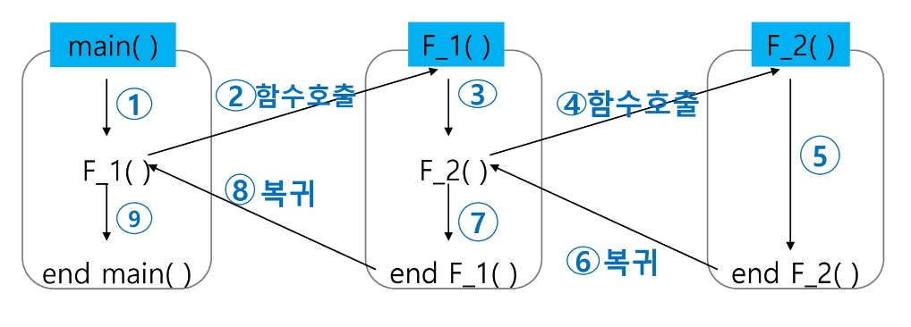
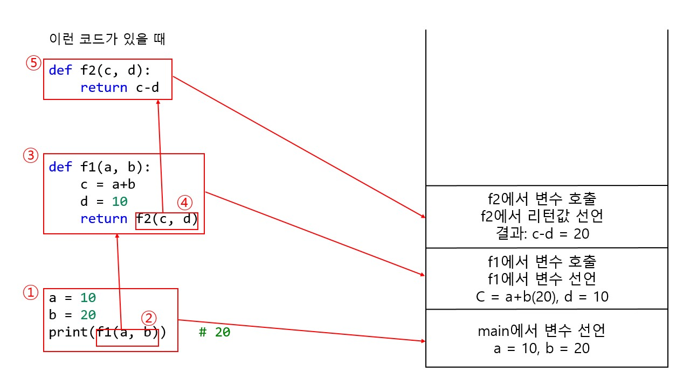
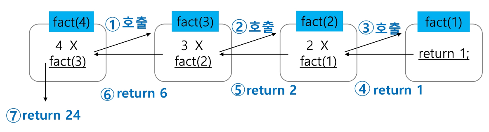

# 스택 (Stack)
- 자료를 쌓아 올린 형태의 선형 자료구조
- 마지막에 삽입한 자료를 가장 먼저 꺼낸다.
    - 후입선출(**LIFO, Last-In-First-Out**)
- 배열을 사용한 스택의 선언
- `top`: 스택에서 마지막으로 삽입된 원소의 위치

## 스택의 연산
- 삽입, 삭제, isEmpty, peek
- 스택의 삽입, 삭제를 진행할 때는 top의 위치도 같이 바꾸어주어야 한다.

### 삽입 (push)
- top을 하나 증가시키고 데이터를 top 자리에 저장

#### 구현
가장 간단하게 구현할 경우 append로 구현할 수 있다.
```python
def push(item):
    stack.append(item)

stack = []
push('a')
print(stack)    # ['a']
```
그러나 append는 효율이 좋지 못하기 때문에 이렇게 구현하는 것을 추천한다.
```python
def push(item, size):
    global top
    top += 1    # top을 먼저 올려주고
    if top == size:    # top이 size랑 동일 -> 인덱스 초과
        print('overflow!')    # overflow
    else:
        stack[top] = item    # top 자리에 item 지정

size = 10    # stack의 크기를 미리 설정
stack = [0]*size
top = -1    # 0부터 인덱스가 시작하므로 초기값은 -1

push(10, size)
print(stack)    # [10, 0, 0, 0, 0, 0, 0, 0, 0, 0]
```
혹은 함수로 따로 정의하지 않고 이렇게 할 수도 있다.
```python
size = 10
stack = [0]*10
top = -1

top += 1
stack[top] = 10
```

### 삭제 (pop)
- 삭제라고는 하지만 일단 저장소에서 자료를 꺼내는 행위
- top을 하나 감소시키고 그 위의 자료를 꺼내기

#### 구현
가장 간단하게 구현할 경우 pop으로 구현할 수 있다.
```python
# 스택의 삽입 첫 번째 코드와 이어진다.

def stack_pop():
    if len(stack) == 0:
        print('underflow!')
        return 0
    else:
        return stack.pop()

print(stack_pop())    # a
print(stack)    # []
```
하지만 이렇게 구현하는 것을 추천한다.
```python
# 스택의 삽입 두 번째 코드와 이어진다.

def stack_pop():
    global top
    if top == -1:
        print('underflow!')
        return 0
    else:
        top -= 1
        return stack[top+1]

print(stack_pop())    # 10    # 제거는 되지 않음
```
혹은 함수로 정의하지 않고 이렇게 할 수도 있다.
```python
# 스택의 삽입 세 번째 코드와 이어진다.

if top > -1:
    top -= 1
    print(stack[top+1])    # 10
```

## 스택의 동적 할당
- 

## 스택의 응용: 괄호 검사
- 조건1: 왼쪽 괄호의 개수와 오른쪽 괄호의 개수가 같은가
- 조건2: 왼쪽 괄호가 오른쪽 괄호보다 먼저 나왔는가
- 조건3: 괄호가 포함관계를 이루고 있는가

### 알고리즘 개요
- 문자열에 있는 괄호를 차례대로 조사하면서 왼쪽 괄호를 만나면 스택에 push, 오른쪽 괄호를 만나면 스택에서 pop을 해서 오른쪽 괄호와 짝이 맞는지 검사한다.
    - 오른쪽 괄호를 만났는데 스택이 비어있을 경우 조건1 혹은 조건 2위배
    - 괄호의 짝이 맞지 않으면 조건3 위배
    - 마지막 괄호까지도 조사했는데 스택에 괄호가 남아있을 경우 조건 1 위배
```python
```

## 스택의 응용: function call
- 프로그램에서의 함수 호출과 복귀에 따른 수행 순서 관리
- 가장 마지막에 호출된 함수가 가장 먼저 복귀하는 후입선출 구조 -> 스택



### 예시와 함께 이해하기


① main에서 변수 선언하고 이는 특정 메모리에 저장이 된다.

② main에서 함수 f1을 호출한다.

③ 함수 f1은 a, b를 변수로 받는데 main에서 f1을 호출할 때 인자로 먼저 작성한 a = 20이 a자리에 들어가고 그 다음 작성한 b = 10이 b자리에 들어간다. 이는 만약 함수 f1이 b, a의 명칭으로 매개변수를 받아도 먼저 인자로 작성한 a = 20이 b자리에 들어가고 나중에 작성한 b = 10이 a자리에 들어간다. 함수가 호출할 때 매개변수 자리에 들어갈 인자는 먼저 작성한 순서대로 들어간다. f1에서는 또 받은 인자를 이용하여 c와 d를 선언한다. (c = a+b = 30, d = 10) 또한 이는 또 다른 특정 메모리에 저장이 된다.

④ 함수 f1에서 함수 f2를 호출한다.

⑤ 함수 f2는 c, d를 변수로 받는데 f1에서 인자로 먼저 작성한 c = 30이 c자리에 들어가고 그 다음 작성한 d = 10이 f2에서 d자리에 들어간다. 이는 만약 함수 f2가 d, c의 명칭으로 매개변수를 받아도 먼저 인자로 작성한 c = 30이 d자리에 들어가고 나중에 작성한 d = 10이 c자리에 들어간다. 또한 이는 또 다른 특정 메모리에 저장이 된다.

⑥ 그 이후에는 f2에서 선언한 리턴값이 다시 f1으로 돌아가고 f2는 사라진다. (스택의 삭제) 동일하게 f1에서 선언한 리턴값은 main으로 들어가고 f1은 사라진다. 이렇게 해서 결과가 나오게 되는 것이다. 결국 가장 먼저 선언한 main의 print가 가장 나중에 작업이 되었으므로 후입선출의 스택!


# 재귀 호출
- 필요한 함수가 자신과 같은 경우 자신을 다시 호출하는 구조

## 팩토리얼 재귀함수
```python
def fact(n):
    if n == 0:
        return 1
    return n*fact(n-1)

print(fact(4))    # 24
```


## 피보나치 수열 재귀함수
- 0과 1로 시작하고 이전의 두 수 합을 다음 항으로 하는 수열
- F0 = 0, F1 = 1, Fn = Fn-1 + Fn-2 (n <= 2)
```python
def fibo(n):    # 여기서 n은 피보나치 수열의 n번째 항을 의미
    if n < 2:
        return n
    return fibo(n-1)+fibo(n-2)

print(fibo(5))    # 5
```

## 재귀 호출을 이용하여 모든 배열 원소에 접근하기
```python
def f(i, N):    # 크기 N인 배열 arr[i]에 접근
    if i == N:    # 끝까지 도달하면 그만
        return
    else:
        print(arr[i])
        f(i+1, N)    # 인덱스를 하나 더 늘리고 또 함수 진행

arr = [0, 1, 2]
f(0, 3)    # 0 1 2
```

## 재귀 호출을 이용하여 배열에 원하는 값이 있는지 찾기
```python
def f(i, N, v):    # v: 찾고자 하는 값
    if i == N:    # 끝까지 찾았는데 없으면 0을 반환
        return 0
    elif arr[i] == v:    # 찾으면 1을 반환
        return 1
    else:
        return f(i+1, N, v)    # 다음 요소에 대해서 또 함수 진행

arr = [1, 2, 3, 4]
print(f(0, 4, 3))    # 1
print(f(0, 4, 5))    # 0
```