# Memoization
- 컴퓨터 프로그램을 실행할 때 이전에 계산한 값을 메모리에 저장
    - 매번 다시 계산하지 않도록 하여 전체적인 실행속도를 빠르게
- 동적 계획법의 핵심
- 예를 들어 피보나치 수를 구하는 재귀 함수에서 memoization을 이용하면 실행시간을 O(2^n)에서 O(n)으로 줄일 수 있다.

## Memoization을 적용한 피보나치 알고리즘
```python
def fibo(n):
    if n >= 2 and memo[n] == 0:    # memo[n]이 0이라는건 fibo(n)이 계산된 적이 없다는 것
        memo[n] = fibo(n-1)+fibo(n-2)
    return memo[n]

n=7
memo = [0]*(n+1)
memo[0] = 0
memo[1] = 1
fibo(n)
print(memo)    # [0, 1, 1, 2, 3, 5, 8, 13]
```

# 동적 계획 (DP, Dynamic Programming)
- 최적화 문제를 해결하는 알고리즘
- 먼저 입력 크기가 작은 부분 문제들을 모두 해결한 후 그 해들을 이용하여 보다 큰 크기의 부분 문제들을 해결

## 피보나치 수에 DP 적용하기
1. 문제를 부분 문제로 분할한다.
    - fibo(n)은 fibo(n-1)과 fibo(n-2)의 합
    - fibo(n-1)은 fibo(n-2)와 fobi(n-3)의 합 ...
    - 이를 종합하면 fibo(n)은 fibo(n-1), fibo(n-2), ..., fibo(2), fibo(1), fibo(0)의 부분 문제로 나뉜다.
2. 가장 작은 부분 문제부터 해를 구한다.
3. 그 결과를 테이블에 저장하고 저장된 부분 문제의 해를 이용하여 상위 문제의 해를 구한다.

### 알고리즘
```python
def fibo(n):
    f = [0]*(n+1)
    f[0] = 0
    f[1] = 1
    for i in range(2, n+1):
        f[i] = f[i-1]+f[i-2]
    
    return f[n]

print(fibo(7))    # 13
```
코드를 보니 8월 6일에 했던 파스칼의 삼각형도 무의식적으로 DP를 사용한 코드였네. 재귀가 어려워서 했던 다른 방법이 오히려 DP였던...

> 재귀적 구조는 오버헤드가 발생하기 때문에 memoization은 재귀적 구조보다 반복적 구조로 DP를 구현할 때 사용하는 것이 성능면에서 보다 효율적이다.

# 깊이 우선 탐색 (DFS, Depth First Search)
- 그래프 구조의 모든 자료를 빠짐없이 검색하는 방법
- 시작 정점의 한 방향으로 갈 수 있는데까지 깊이 탐색하다가 더 이상 갈 곳이 없게 된다면 **가장 마지막에 만났던 갈림길이 있는 정점**으로 되돌아와서 다른 방향으로 탐색을 계속 반복
    - 가장 마지막에 만났던 갈림길이 있는 정점으로 되돌아가기 때문에 후입선출 구조의 스택 사용

## 기본적인 알고리즘
1. 시작 정점 v를 결정하여 방문
2. 정점 v에 인접한 정점 중에서
    - 방문하지 않은 정점 w가 있다면 **정점 v를 스택에 push**하고 정점 w를 방문하고 w를 v로 하여 다시 2를 반복
    - 방문하지 않은 정점이 없다면 탐색의 방향을 바꾸기 위해 **스택을 pop하여 가장 마지막 방문 정점을 받은 후** 이를 v로 하여 다시 2를 반복
3. 스택이 공백이 될 때까지 2를 반복

### 그림을 통한 이해
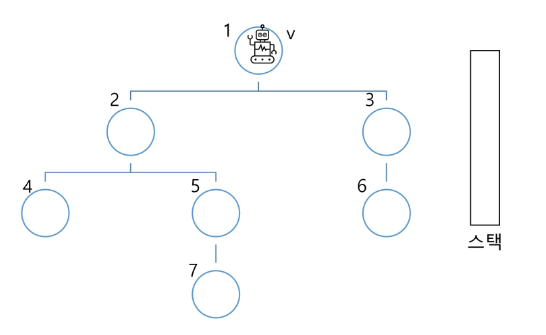

시작 정점 v=1이므로 우선 시작 정점을 결정하여 방문한다.

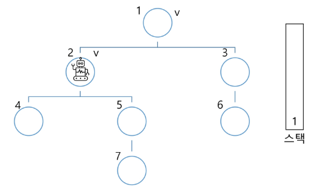

1과 인접한 정점 중 방문하지 않는 정점 w를 일정한 규칙에 따라 방문한다. 여기서는 오름차순으로 방문할 것이므로 w=2를 방문한다. 기존 정점 v=1은 스택에 push하고 v=w로 재할당한다.

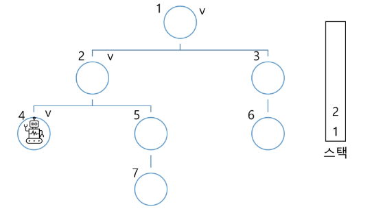

동일하게 계속 방문한다.

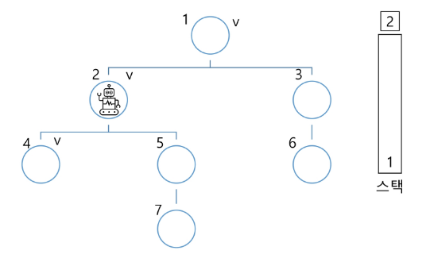

인접한 정점 중 방문하지 않은 정점이 없을 경우 스택을 pop하고 해당 정점으로 이동한다. 이를 v로 하여 다시 위의 과정을 반복한다.

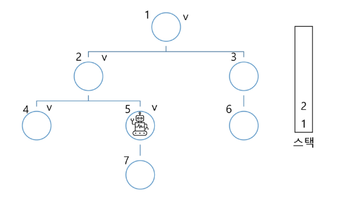
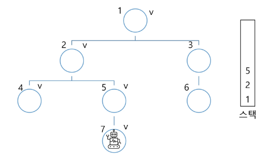
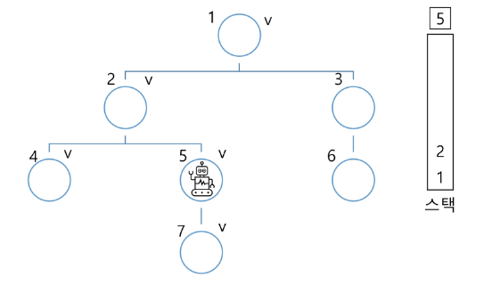
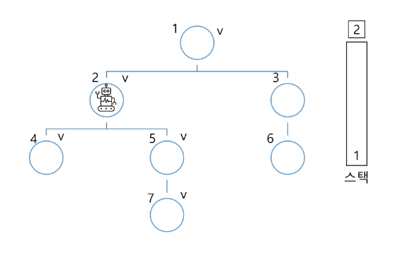
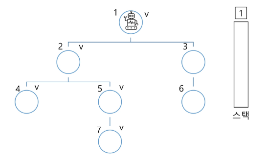
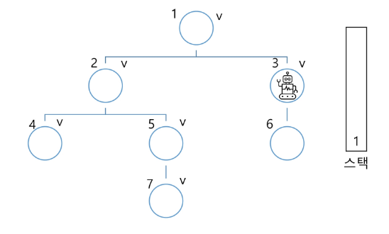
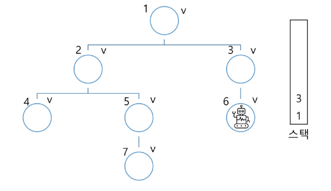
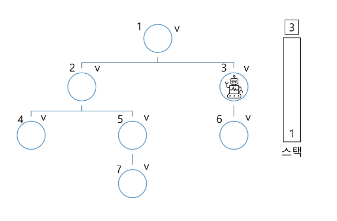
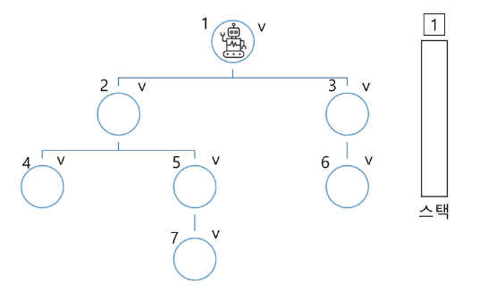
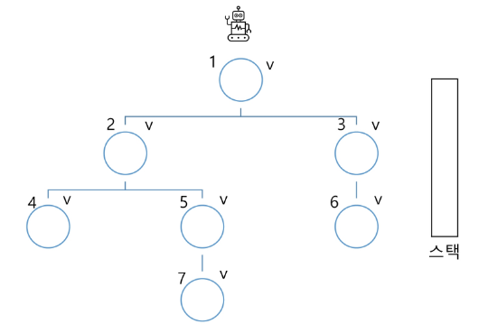

스택이 비면 모든 모든 탐색을 종료했다는 의미이므로 끝낸다.

## 연습문제를 이용한 코드 이해
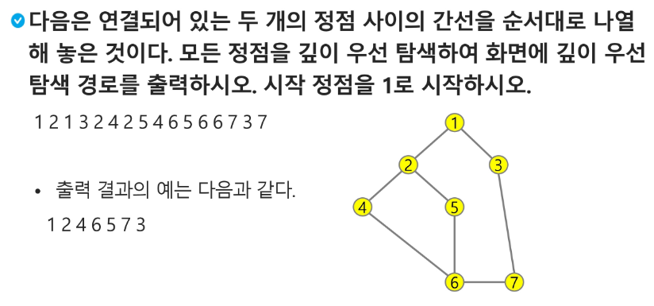

### 기본적으로 주어지는 입력값
```python
1    # 테스트 케이스 수
7 8    # 순서대로 노드와 간선의 개수
1 2 1 3 2 4 2 5 4 6 5 6 6 7 3 7    # 연결되어 있는 노드를 순서대로 나열한 것
# 앞에서부터 차례대로 두개 씩 묶으면 그게 서로 연결되어 있는 노드를 의미한다.
```

### 문제를 풀기 위해 필요한 리스트의 종류
1. `adjL`: 연결되어 있는 노드를 순서대로 나열한 리스트를 토대로 한 노드에 인접한 노드를 담는 이중 리스트. adjL리스트의 인덱스가 곧 노드의 번호가 되며 해당 인덱스를 가진 노드와 인접한 노드를 요소로 갖게 된다.
2. `visited`: 각 정점의 방문 유무를 표현하기 위한 리스트
3. `stack`: 방문한 정점을 하나씩 담을 stack

### 코드
```python
def DFS(s, V):    # s는 시작 정점, V는 정점 개수
    visited = [0]*(V+1)    # 각 정점의 방문 유무를 표현하기 위한 리스트로 0을 제외하고 1부터 V까지 있어야 하므로 V+1개
    stack = []    # 방문한 정점을 하나씩 담을 stack
    print(s)    # 우선 방문한 시작 정점을 출력
    visited[s] = 1    # 시작 정점을 방문
    v = s    # 시작 정점을 v로 지정    # v는 현재 위치해있는 정점을 의미한다고 생각하면 편하다.
    # 여기서부터 하나씩 탐색해가는 과정
    while True:    # for-else문은 for문이 다 실행되어 break가 가지 않을 경우 else가 실행이 된다.
        for next in adjL[v]:    # v에 인접한 노드 중
            if visited[next] == 0:    # 방문하지 않았다면
                stack.append(v)    # 현재 v를 stack에 push하고
                v = next    # w를 새로운 v로 지정 = next를 방문하겠다는 의미
                print(v)    # 방문한 정점을 출력
                visited[v] = 1    # 방문 표시
                break    # 빠져나오고 바뀐 v에 대해 for문 시행 (for를 빠져나오면 다시 while True부터 내려오게 되니까)
        else:    # break가 걸리지 않았다는건 for문이 시행되지 않았다는 것 즉 인접한 노드가 없다는 것으로 else문 실행
            if stack:    # stack에 무언가가 존재할 경우
                v = stack.pop()    # stack을 pop하고 나온 값(= 가장 최근에 방문한 갈림길 정점)을 뒤로 가서 방문
            else:    # stack에 아무것도 없을 경우
                break    # 탐색이 완료되었다는 것이므로 break


T = int(input())
for tc in range(1, T+1):
    V, E = map(int, input().split())
    arr = list(map(int, input().split()))
    adjL = [[] for _ in range(V+1)]    # 0을 제외하고(0번 노드는 없으므로) 노드의 개수만큼 리스트가 있어야 하므로 range(V+1)
    for i in range(E):    # 간선의 개수까지 (arr의 길이의 절반)
        v1, v2 = arr[i*2], arr[i*2+1]    # 2개씩 묶어서 생각해야하므로 i*2를 해줘야 하며 바로 옆의 요소가 인접한 노드가 되는 것이므로 i*2+1
        adjL[v1].append(v2)    # v1과 연결되어 있는 노드는 v2이므로 adjL의 인덱스가 v1인 리스트에 v2를 append
        adjL[v2].append(v1)    # v2도 v1과 연결되어 있으므로 반대로도 해주기
    # 여기까지 하면 깊이 우선 탐색을 위한 기본적인 준비는 끝났다.

    DFS(1, V)    # 1 2 4 6 5 7 3
```

## 재귀를 이용한 DFS
위의 문제를 재귀를 이용해서 풀어보았다.
```python
# 재귀를 이용한 dfs

def DFS(v):    # v: 방문 정점
    # 방문 처리
    visited[v] = True
    result.append(v)
    # 다음 갈 곳을 확인
    for next in adjL[v]:
        # 다음 갈 곳이 방문하지 않았다면
        if visited[next] == False:
            DFS(next)

T = int(input())
for tc in range(1, T+1):
    V, E = map(int, input().split())
    adjL = [[] for _ in range(V+1)]
    arr = list(map(int, input().split()))
    for i in range(E):
        v1, v2 = arr[i*2], arr[i*2+1]
        adjL[v1].append(v2)
        adjL[v2].append(v1)

    visited = [False]*(V+1)
    result = []
    DFS(1)
    print(result)    # [1, 2, 4, 6, 5, 7, 3]
```
굉장히 쉬워졌다!
