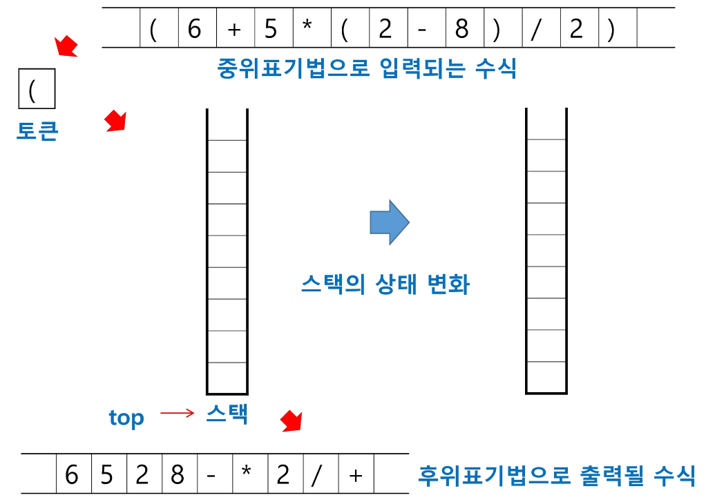
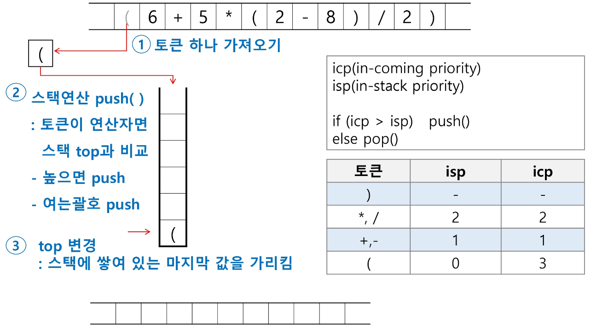
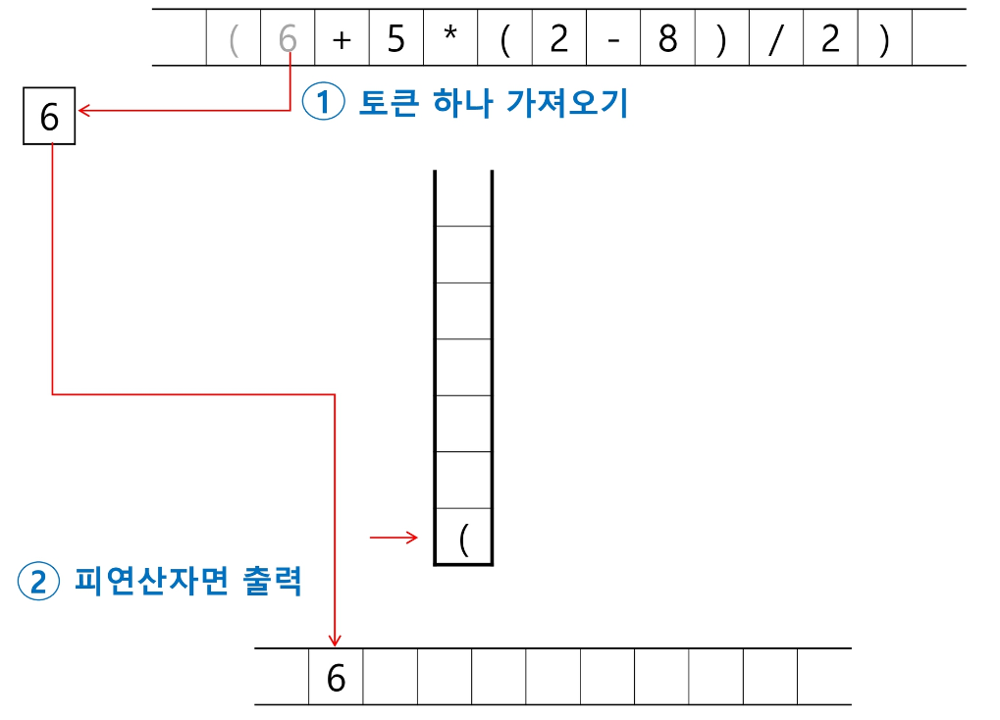
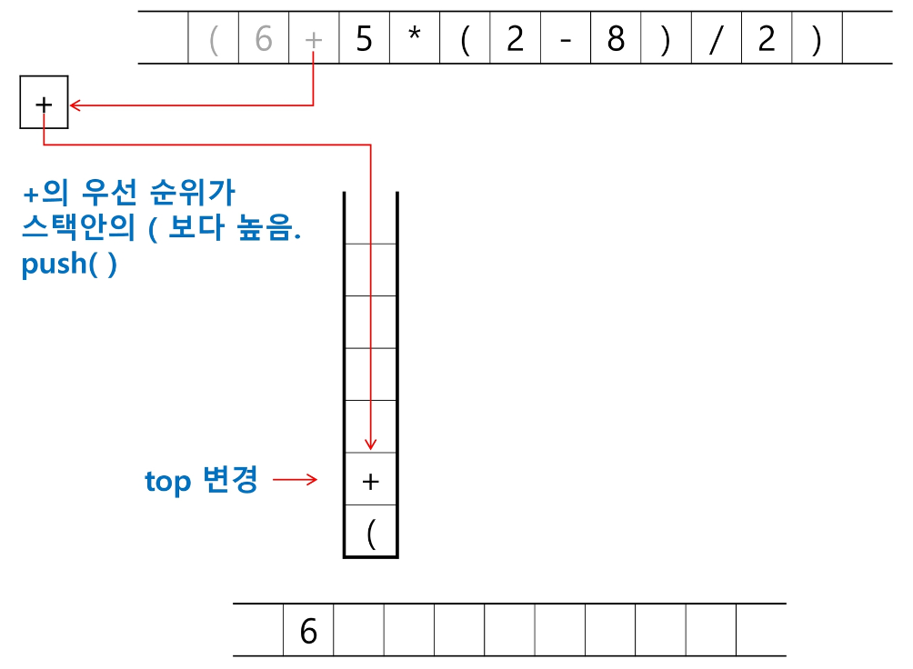
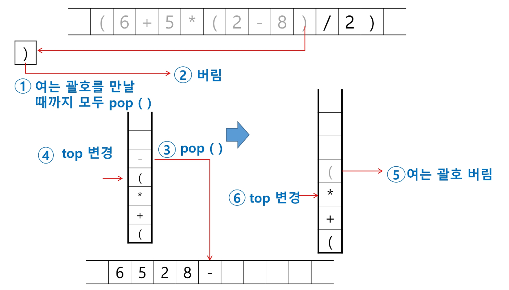
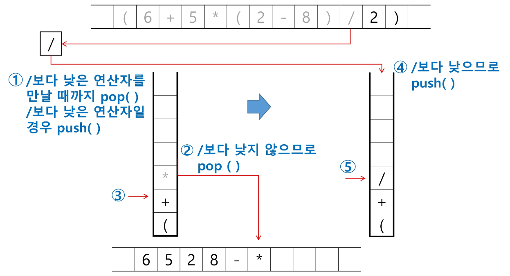
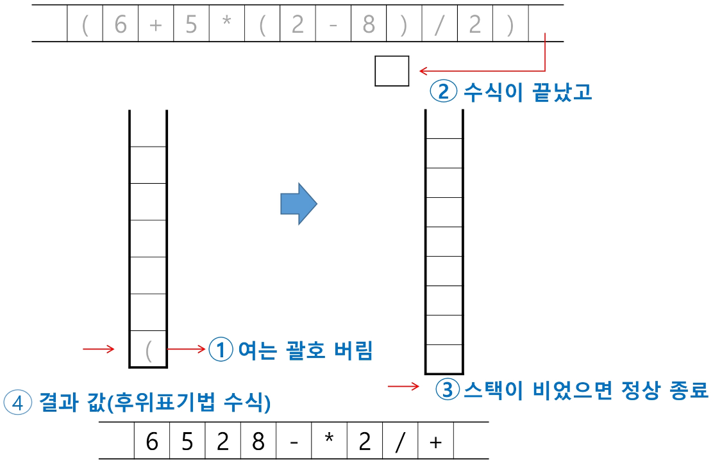
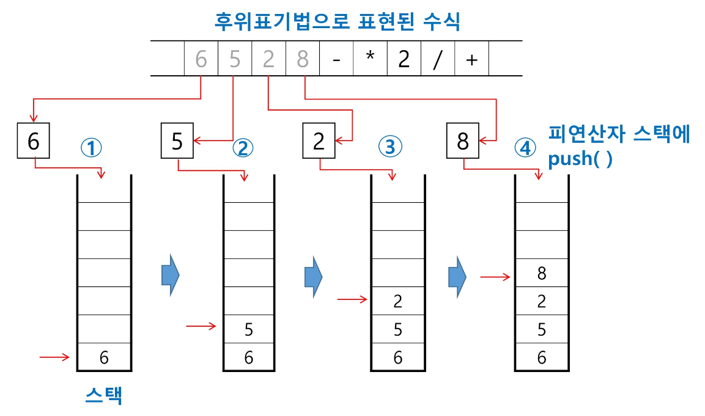
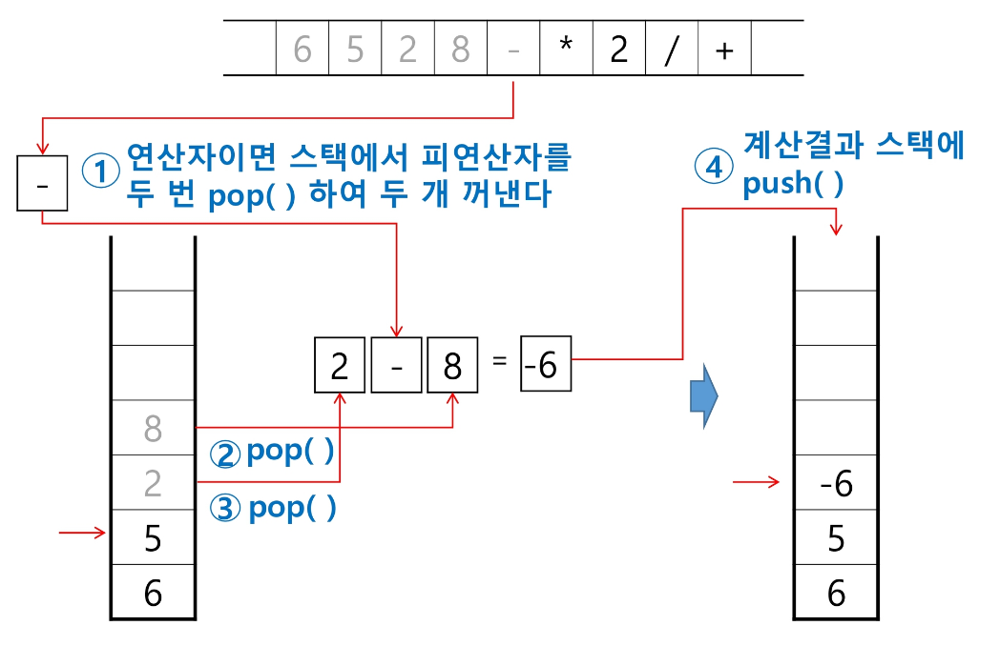
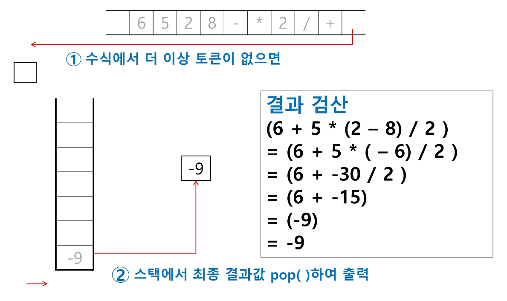

# 문자열 수식 계산
- 스택을 이용하여 계산할 수 있다.

## 기본 방법
1. 중위 표기법의 수식을 후위 표기법으로 변경한다.
    - 중위 표기법(infix notation): 연산자를 피연산자의 가운데에 표기하는 방법
        - A+B
    - 후위 표기법(postfix notation): 연산자를 피연산자의 뒤에 표기하는 방법
        - AB+
2. 후위 표기법의 수식을 스택을 이용하여 계산한다.

## 중위 표기법의 수식을 후위 표기법으로 변경하기
### 기본적인 방법
1. 수식의 각 연산자에 대해서 우선순위에 따라 괄호를 사용하여 다시 표현
2. 각 연산자를 그에 대응하는 닫는 괄호의 뒤로 이동시키고 괄호를 제거
```
ex) 6+5*(2-8)/2

1단계. (6+((5*(2-8))/2))
2단계. (6((5(28)-)*2)/)+

결과. 6528-*2/+
```

### 스택을 이용한 변환 알고리즘
#### 알고리즘 개요
1. 입력 받은 중위 표기식에서 토큰(연산자 or 피연산자)을 읽는다.
2. 토큰이 피연산자일 경우 토큰을 출력한다.
3. 토큰이 연산자일 경우
    - 해당 연산자가 닫는 괄호를 제외한 나머지 연산자일 때
        - 스택의 top에 저장되어 있는 연산자보다 우선순위가 높을 경우 스택에 push
        - 그렇지 않을 경우 top의 연산자의 우선순위가 토큰의 우선순위보다 작을 때까지, 즉 push가 가능할 때까지 pop하고 push한다.
    - 해당 연산자가 닫는 괄호일 때
        - 스택의 top에 여는 괄호가 올 때까지 pop 연산을 수행하고 pop한 연산자는 출력한다.
        - 여는 괄호를 만나면 pop만 하고 출력하지는 않는다.
    - top에 연산자가 없을 경우 push한다.
4. 중위 표기식에 더 읽을 것이 없다면 중지하고 더 읽을 것이 있다면 1부터 다시 반복한다.
5. 스택에 남아 있는 연산자를 모두 pop하여 출력한다.

#### 연산자 우선순위
- 숫자가 높을수록 우선순위가 높다.

|토큰|스택의 밖에 있을 때|스택의 안에 있을 때|
|:----:|:----:|:----:|
|)|-|-|
|*, /|2|2|
|+, -|1|1|
|(|0|3|

- 여는 괄호의 경우 스택의 밖에 있을 때(push할 때)와 스택의 안에 있을 때(pop할 때)의 우선순위가 다르다.
    - 여는 괄호는 무조건 push하고 스택의 안에 있을 때는 닫는 괄호가 나오지 않는 이상 pop을 하지 않는다.
- 닫는 괄호는 우선순위와 상관 없이 움직이기 때문에 우선순위가 없다.
- 나머지 연산자의 우선순위는 우리가 사칙연산을 할 때 우선순위로 생각해주면 편할듯하다.

#### 그림으로 알아보기

**0단계**



기본 준비 상태. 연산자를 담을 스택과 후위표기법으로 입력되는 토큰을 담을 리스트가 필요하다.

**1단계**



여는 괄호는 스택 밖에 있을 때 우선순위가 제일 높으므로 무조건 push를 한다.

**2단계**



피연산자는 그대로 출력할 리스트에 담아준다.

**3단계**



여는 괄호는 스택 안에서 우선 순위가 가장 낮으므로 '+'를 push한다.

**4단계**

계속해서 피연산자는 출력, 연산자는 우선순위에 따른 push를 해준다. (사진 생략)

**5단계**



닫는 괄호가 나오면 여는 괄호를 만날 때까지 모두 pop하고 출력한다. 여는 괄호를 만나면 pop하고 출력은 하지 않는다. 동일하게 닫는 괄호도 출력하지 않는다.

**6단계**



'*'의 경우 '/'와 동일한 우선순위, 즉 낮지 않은 우선순위를 갖고 있기 때문에 pop하고 출력한다. 그 뒤의 '+'는 '/'보다 낮은 우선순위를 갖고 있기 때문에 push한다.

**7단계**

뒤의 과정도 동일한 규칙으로 반복해준다.

**8단계**



수식이 끝났을 경우 스택을 확인하여 스택이 비었다면 종료하고 후위표기법으로 나타낸 결과값을 얻는다.

#### 코드
```python
import sys

sys.stdin = open('input.txt')

def icp(oper):    # 스택 밖에 있을 때 우선순위를 지정하는 함수
    if oper == '(':
        return 3
    elif oper in ('*', '/'):
        return 2
    elif oper in ('+', '-'):
        return 1

def isp(oper):    # 스택 안에 있을 때 우선순위를 지정하는 함수
    if oper == '(':
        return 0
    elif oper in ('*', '/'):
        return 2
    elif oper in ('+', '-'):
        return 1

# Testcase 수
T = int(input())
# Testcase 만큼 반복
for tc in range(1, T+1):

    infix = list(input())
    stack = []
    top = -1
    postfix = []    # 후위표기법의 결과를 담는 리스트

    for token in infix:
        if token.isdecimal():    # 숫자면
            postfix.append(token)    # postfix에 append
        else:
            if not stack:    # 스택이 비어있으면
                top += 1
                stack.append(token)    # 무조건 push
            else:    # 스택이 채워져 있는데
                if token != ')':    # 닫는 괄호가 아니면
                    if isp(stack[top]) < icp(token):    # top에 있는 것보다 내 우선순위가 더 높으면
                        top += 1
                        stack.append(token)    # push
                    else:    # 그렇지 않으면
                        while isp(stack[top]) >= icp(token):    # 내 우선순위가 더 높아질 때까지
                            top -= 1
                            temp = stack.pop()
                            postfix.append(temp)    # top을 pop하고 pop한 걸 postfix에 append
                        top += 1
                        stack.append(token)    # 내 우선순위가 높아지면 push
                else:    # 닫는 괄호의 경우에는
                    while stack[top] != '(':    # 여는 괄호를 만날 때까지
                        top -= 1
                        temp = stack.pop()
                        postfix.append(temp)    # top을 pop하고 postfix에 append
                    top -= 1
                    stack.pop()    # 여는 괄호를 만나면 여는 괄호 pop만 하기

    while stack:    # 스택이 비어질 때까지
        temp = stack.pop()
        postfix.append(temp)    # 남아있는 애들을 모두 pop하고 postfix에 append

    print(f"#{tc} {''.join(postfix)}")
```

## 후위 표기법의 수식을 스택을 이용하여 계산하기
### 알고리즘 개요
1. 피연산자를 만나면 스택에 push한다.
2. 연산자를 만나면 필요한 만큼의 피연산자를 스택에서 pop하여 연산하고 연산결과를 다시 스택에 push한다.
3. 수식이 끝나면, 마지막으로 스택을 pop하여 출력한다.

### 그림으로 알아보기
#### 1단계



피연산자를 만나면 스택에 push한다.

#### 2단계



연산자를 만나면 스택에서 피연산자를 두 번 pop한다. 이때 먼저 pop한 피연산자를 연산자의 오른쪽에, 나중에 pop한 피연산자를 연산자의 왼쪽에 놓고 계산한다. 계산한 결과는 다시 스택에 push한다.

#### 3단계

수식에 더 이상 토큰이 없을 때까지 반복한다. (사진 생략)

#### 4단계



수식에 더 이상 토큰이 없다면 스택에서 최종 결과값을 pop하여 출력한다.

### 코드
```python
def calculate():
    num2 = stack.pop()
    num1 = stack.pop()

    return num1, num2

postfix = ['6', '5', '2', '8', '-', '*', '2', '/', '+']
stack = []

for token in postfix:
    if token.isdecimal():
        stack.append(int(token))
    else:
        if token == '-':
            num1, num2 = calculate()
            temp = num1 - num2
            stack.append(temp)
        elif token == '+':
            num1, num2 = calculate()
            temp = num1 + num2
            stack.append(temp)
        elif token == '*':
            num1, num2 = calculate()
            temp = num1 * num2
            stack.append(temp)
        else:
            num1, num2 = calculate()
            temp = num1 / num2
            stack.append(temp)

result = stack.pop()
print(result)
```

# 백트래킹
- 해를 찾는 도중 '막히면' 되돌아가서 다시 해를 찾아가는 기법
- 최적화(Optimization) 문제와 결정(Decision) 문제 해결에 도움
    - 최적화 문제: 최대최소를 찾는 등의 문제
    - 결정 문제: 해가 존재하는지의 여부를 yes 또는 no로 답하는 문제
        - 미로 찾기, n-Queen 문제 등

## 깊이 우선 탐색과의 차이
- 깊이 우선 탐색
    - 모든 경로를 추적하는 것이 기본으로 깔려져 있다.
    - 일단 다 탐색한 다음 그 경로 중에서 조건에 맞는 경로와 결과를 내는 것.
    - 시간이 오래 걸릴 수밖에 없다.
- 백트래킹
    - 탐색하고 있는 경로가 결과를 낼 수 없을 것 같은 경우 해당 경로 탐색을 종료하고 새로운 경로를 탐색함으로써 횟수를 줄인다.
        - Prunning 가지치기

## 예시 문제
- 미로 찾기 문제

### 코드
```python
import sys

sys.stdin = open('input.txt')

def find_route(start_i, start_j, N):    # 길 찾는 함수로 인자는 처음 시작점의 행과 열 그리고 전체 미로의 크기
    visited[start_i][start_j] = 1    # 방문한 곳에 방문했다는 것 표시
    if maze[start_i][start_j] == 3:
        return 1    # 만약 방문한 곳이 3일 경우 도착했다는 것이므로 1을 반환하고 종료
    else:    # 그 외의 경우 오른쪽 아래 왼쪽 위 방향 순서대로 인접탐색
        for di, dj in [[0, 1], [1, 0], [0, -1], [-1, 0]]:
            ni, nj = start_i + di, start_j + dj
            if 0 <= ni < N and 0 <= nj < N and maze[ni][nj] != 1 and visited[ni][nj] == 0:
                # 인접 탐색한 위치가 허용 인덱스 안이고 벽이 아니며 가본 적이 없을 경우
                if find_route(ni, nj, N):    # 해당 인덱스 안에서 함수 다시 시행
                    return 1    # 얘는 도착을 해서 가장 최근에 함수를 종료했을 때 그때까지 쌓였던 함수들을 모두 종료시키고 완전히 재귀함수를 빠져나가는 역할
        return 0    # 만약 모든 인접 탐색한 위치가 이동 불가능한 곳이라면 0을 반환하고 가장 최근 불렀던 함수로 가기
        # 이 과정이 진짜 중요하다. 가장 최근에 반환한 함수로 가고 또 거기서는 다시 인접탐색을 하면서 결국 마지막으로 갈림길이 있던 곳으로 이동해 새로운 길을 찾는다는 것이 포인트


# Testcase 수
T = int(input())
# Testcase 만큼 반복
for tc in range(1, T+1):

    N = int(input())
    maze = [list(map(int, input().strip())) for _ in range(N)]

    for i in range(N):
        for j in range(N):
            if maze[i][j] == 2:
                start_i, start_j = i, j
                break

    visited = [[0]*N for _ in range(N)]

    result = find_route(start_i, start_j, N)

    print(f'#{tc} {result}')
```

위 코드에서 `if maze[start_i][start_j] == 3: return 1` 이 부분이 백트래킹에 해당하는 부분이다.

> 사실 백트래킹이라고 해서 뭐 특별한 방법은 아니고 그냥 결과를 찾거나 결과가 아닌 것 같으면 계산을 멈추고 다음으로 넘어가는 그 자체를 백트래킹이라고 해서... 우리는 알게 모르게 계속 백트래킹을 사용하고 있었던 것이다.