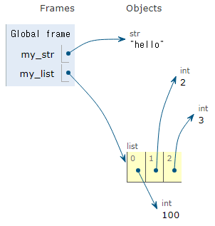

# Python의 데이터 타입 - Sequence Type (이어서)

## list
 - 여러 개의 값을 순서대로 저장하는 변경 가능한 시퀀스 자료형
    - 인덱스를 이용하여 요소의 값을 변경할 수 있다.
 - 어떤 자료형도 저장할 수 있으며 빈 리스트도 만들 수 있다.
 ```python
 my_list_1 = [] # 빈 리스트
 my_list_2 = [1, 2, 3, ['python', 'happy', 100]] # 중첩 리스트
 ```
 ### 중첩 list 접근
 ```python
 my_list=[1, 2, 3, ['python', 'happy', 100]]
 
 print(my_list[3]) # ['python', 'happy', 100]
 print(my_list[3][0]) # python
 print(my_list[3][0][2]) # t
 ```

## tuple
  - 여러 개의 값을 순서대로 저장하는 변경 불가능한 시퀀스 자료형
  - 어떤 자료형도 저장할 수 있으며 빈 튜플도 만들 수 있다.
  ```python
  my_tuple_1 = () # 빈 튜플
  my_tuple_2 = (1, 'a', 2, 'b', 3)
  ```
  > 튜플은 불면 특성을 사용하여 파이썬 내부동작에서 안전하게 여러 개의 값을 전달하거나 다중 할당을 할 때 사용된다.
  >
  > 개발자가 직접 사용하는 경우는 별로 없다. 개발자는 `튜플보다는 리스트`를 더 많이 사용한다.
  > ```python
  > x, y = (10, 20)
  >
  > print(x) # 10
  > print(y) # 20
  > 
  > x, y = 10, 20
  > ```
  > 위에서는 tuple을 다중 할당을 위해 사용하였다. 그러나 파이썬은 쉼표를 튜플 생성자로 사용하기 때문에 괄호를 생략해도 동일하게 다중 할당이 된다.

## range
 - 연속된 정수 시퀀스를 생성하는 변경 불가능한 자료형
 - `range(시작 값, 끝 값, 증가 값)`
    - 시작 값부터 끝 값-1까지 증가 값만큼 증가하면서 하나씩 나열
    - 증가 값이 없으면 1씩 증가한다.
    - 증가 값이 음수이면 감소하고 양수이면 증가한다.
        - 증가 값이 음수이면 시작 값이 끝 값보다 커야 한다.
        - 증가 값이 양수이면 시작 값이 끝 값보다 작아야 한다.
    - 증가 값이 0이면 에러가 발생한다.
 - `range(n)`: 0부터 n-1까지의 숫자
    - n-1까지의 숫자인 이유는 `range(n)은 항상 0을 포함하기 때문에 n개의 숫자를 나열하기 위해서는 n-1까지 담을 수 있기 때문` 정도라고 생각하면 될 것 같다.
 - `range(n, m)`: n부터 m-1까지의 숫자
 - range는 리스트로 형 변환 시 데이터 확인이 가능하다.
 ```python
 my_range = range(5)

 print(my_range) # range(5)
 print(list(my_range)) # [0, 1, 2, 3, 4]
 ```
 - 주로 반복문과 함께 사용한다.

# Python의 데이터 타입 - Non-sequence Type

## dict
 - `key-value 쌍`으로 이루어진 순서와 중복이 없는 변경 가능한 자료형
    - key는 변경 불가능한 자료형(str, int, tuple, range, ...)만 사용 가능
    - value는 모든 자료형 사용 가능
    - 빈 딕셔너리도 만들 수 있다.
 - key를 통해 value에 접근한다.
    - key를 먼저 찾고 그에 맞는 value를 읽는다.
    - key는 중복될 수 없기 때문에 동일한 key에 다른 값을 할당하면 추가가 되는 것이 아니라 변경이 된다.
    ```python
    my_dict_1 = {} # 빈 딕셔너리
    my_dict_2 = {'name':'신짱구', 'age':5}

    print(my_dict_2['name']) # 신짱구
    my_dict_2['name']='김철수'
    print(my_dict_2['name']) # 김철수
    ```
## set
 - 순서와 중복이 없는 변경 가능한 자료형
    - 중복이 존재할 수 없기 때문에 `my_set={1, 1, 1}`은 결국 `my_set={1}`이다.
 - 수학에서의 집합과 동일한 성질을 가지고 있다.
 - 빈 세트도 만들 수 있지만 `my_set={}`의 경우 빈 딕셔너리로 인식하기 때문에 `my_set=set()`을 사용해야 한다.
 - 집합 연산이 가능하다. (합집합, 차집합, 교집합)
    ```python
    my_set_1={1, 2, 3}
    my_set_2={3, 6, 9}

    # 합집합
    print(my_set_1|my_set_2) # {1, 2, 3, 6, 9}

    # 차집합
    print(my_set_1 - my_set_2) # {1, 2}

    # 교집합
    print(my_set_1 & my_set_2) # {3}
    ```

# Python의 데이터 타입 - Other Type

## None
 - '값이 없음'을 표현하는 자료형
    - 아예 '무'가 아니라 '자료 없음'을 의미하는 것

## Boolean
 - 참(True)과 거짓(False)을 표현하는 자료형
 - 비교/논리 연산의 평가 결과로 사용된다.
```python
print(3>1) # True
print('3'==3) # False
```

# 그 외 데이터 타입 관련 알아둘 사항

## Collection
 - 여러 개의 항목 또는 요소를 담는 자료 구조
 - str, list, tuple, set, dict
    - 이 중 str, tuple은 immutable 자료형, 나머지는 mutable 자료형
    - 이 중 str, list, tuple은 sequence, 나머지는 non-sequence

## 불변과 가변의 차이
str와 tuple은 요소를 변경할 수 없고 list는 요소를 변경할 수 있다. 왜 그럴까?

list는 요소의 값 자체를 가지고 있는 것이 아니라 `각 요소의 메모리 주소`를 가지고 있는 것이다. 따라서 list는 인덱스를 이용하여 요소를 변경하면 해당 인덱스가 가리키는 메모리 주소만 바꾸면 되기 때문에 변경할 수 있는 것이다.

list 뿐만 아니라 요소 변경이 가능한 애들은 다 이런 이유로 가능하다.

그러나 immutable 자료형은 이것이 불가능하기 때문에 수정할 수 없다.

<p align="center">
 
</p>

이런 식으로 list는 요소 하나하나가 서로 다른 메모리에 저장이 되어 있기 때문에 해당 요소가 가리키는 메모리 주소를 변경함으로써 인덱싱이 요소 변경이 가능한 것이다.

> ### 몇 가지 질문 사항
> Q1. 그러면 tuple은 list 요소의 값 자체를 가지고 있는 것인가? 
>
> A1. tuple은 list와 동일한 방식으로 메모리에 요소가 저장이 되지만 값을 수정할 수 있는 기능을 제거한 자료형이기 때문에 요소 변경이 불가능한 것이다.
>
> Q2. 그러면 str은 요소 전체가 하나의 메모리에 저장되어 있는 것인가?
>
> A2. 맞다. str은 요소 전체가 하나의 메모리에 저장되어 있는 것이다. 그러나 그 하나의 메모리 안에서 각각의 문자들이 차지하고 있는 byte가 있기 때문에 그걸 구분해서 인덱싱을 하는 것이다.


# 형변환
 - 한 데이터 타입을 다른 데이터 타입으로 변환하는 과정

## 암시적 형변환
 - 파이썬이 자동으로 수행하는 형변환
 - Boolean과 Numeric Type에서만 가능
```python
print(3+5.0) # 8.0
print(True+3) # 4
print(True+False) # 1
```
참고로 파이썬에서 `True=1, False=0` 이다.
> 최대한 암시적 형변환이 일어나지 않도록 코드를 작성하는 것이 좋다.

## 명시적 형변환
 - 프로그래머가 직접 지정하는 형변환
 - 변환하려는 형식에 맞는 값만 형변환이 가능하다.
    - ex. str->int에서 `print(int('3.5'))`는 형변환 불가. 임의로 파이썬이 `0.5를 버리고 3으로 출력`한다.)
 - 다양한 형변환을 시도해보고 어떤 것이 가능한지 어떤 것이 불가능한지 알아보자.

# 연산자

## 산술 연산자
|기호|연산자|기호|연산자|
|:----:|:----:|:----:|:----:|
|-|음수부호|+|덧셈|
|-|뺄셈|*|곱셈|
|/|나눗셈|//|정수 나눗셈(몫)|
|%|나머지|**|지수 (거듭제곱)|

## 복합 연산자
 - 연산과 할당이 함께 이뤄지는 연산자

|기호|예시|의미|기호|예시|의미|
|:----:|:----:|:----:|:----:|:----:|:----:|
|+=|a+=2|a=a+2|-=|a-=2|a=a-2|
|*=|a*=2|a=a*2|/=|a/=2|a=a/2|
|//=|a//=2|a=a//2|%=|a%=2|a=a%2|
|**=|a**=2|a=a**2|

## 비교 연산자
|기호|내용|기호|내용|
|:----:|:----:|:----:|:----:|
|<|미만|<=|이하|
|>|초과|>=|이상|
|==|같음|!=|같지 않음|
|is|같음|is not|같지 않음|

### is 비교 연산자
 - 메모리 내에서 같은 객체를 참조하는지 확인
 - ==는 값 자체가 같은지, is는 메모리 주소까지 같은지
```python
print(2.0==2) # True
print(1==True) # True

print(1 is True) # False
print(2 is 2.0) # False
```
 결국 제일 좋은 코드는 같은 타입의 데이터끼리 비교하는 것이다.
> is는 보통 None이나 Boolean이랑 비교할 때 쓴다.
>
> 그러나 앞으로 코딩을 할 때는 값의 비교가 메모리 주소의 비교보다 중요하기 때문에 대부분의 상황에서는 `==`를 사용할 것이다.

## 논리 연산자
|기호|연산자|내용|
|:----:|:----:|:----|
|and|논리곱|두 피연산자 모두 True인 경우에만 전체 표현식을 True로 평가|
|or|논리합|두 피연산자 중 하나라도 True인 경우 전체 표현식을 True로 평가|
|not|논리부정|단일 피연산자를 부정|

```python
print(True and False) # False
print(True or False) # True
print(not True) # False
```
비교 연산자와 함께 사용 가능하다.

# 단축평가
 - 논리 연산에서 두 번째 피연산자를 평가하지 않고 결과를 결정하는 동작
 - 앞에서 이미 결론이 났다고 판단하면 뒤의 과정을 진행하지 않는 것이다.

```python
vowels = 'aeiou'

[1] print(('a' and 'b') in vowels) # False
[2] print(('b' and 'a') in vowels) # True

[3] print(3 and 5) # 5
[4] print(3 and 0) # 0
[5] print(0 and 3) # 0
[6] print(0 and 0) # 0

[7] print(5 or 3) # 5
[8] print(3 or 0) # 3
[9] print(0 or 3) # 3
[10] print(0 or 0) # 0
```
[1]의 경우 'a'는 True이기 때문에 계속 평가를 진행해서 'b' 연산자까지 평가하고 'b'를 이용해서 평가한다. 따라서 False가 나온다.

[2]의 경우에도 마찬가지로 'a'까지 쭉 평가를 진행하고 'a'를 이용해서 뒤 과정을 진행하기 때문에 True가 나오는 것이다.

반면 [5]의 경우에는 0이 False이고 and는 하나라도 False면 False기 때문에 평가를 여기서 마무리한다. 그래서 0이 출력이 되는 것이다.

[7]의 경우 5는 True이고 or은 하나라도 True면 True기 때문에 평가를 여기서 마무리한다. 그래서 5가 출력된다.

반면 [9]의 경우에는 0이 False이기 때문에 계속 평가를 진행해서 3까지 평가하고 따라서 3이 출력이 된다.

> 이렇게 복잡한걸 하는 이유는 코드 실행을 최적화하고 불필요한 연산을 피하기 위함이다.
> 
> 하지만 역시 마음에 안 든다.

## 멤버십 연산자
 - 특정 값이 시퀀스나 다른 컬렉션에 속하는지 여부를 확인

 |기호|내용|
 |:----:|:----|
 |in|왼쪽 피연산자가 오른쪽 피연산자의 시퀀스에 속하는지를 확인|
 |not in|왼쪽 피연산자가 오른쪽 피연산자의 시퀀스에 속하지 않는지를 확인|

 ```python
 word = 'hello'
 numbers = [1, 2, 3, 4, 5]

 print('h' in word)  # True
 print('z' in word)  # False

 print(4 not in numbers)  # False
 print(6 not in numbers)  # True
 ```

## 시퀀스형 연산자
 - +와 *는 시퀀스 간 연산에서 산술 연산자일 때와 다른 역할을 가진다.

|연산자|내용|
|:----:|:----:|
|+|결합 연산자|
|*|반복 연산자|

```python
print('Gildong' + ' Hong')  # Gildong Hong
print('hi' * 5)  # hihihihihi

print([1, 2] + ['a', 'b'])  # [1, 2, 'a', 'b']
print([1, 2] * 2)  # [1, 2, 1, 2]
```
