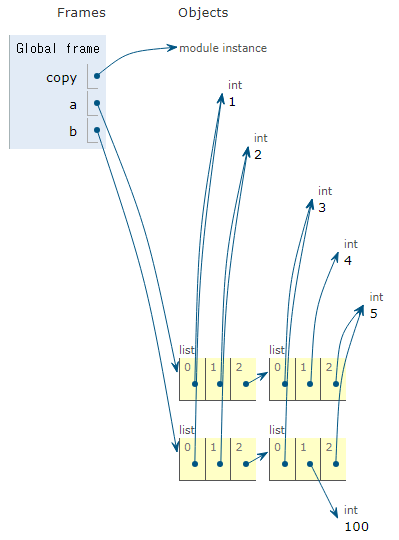

# 데이터 구조
- 여러 데이터들을 효과적으로 사용, 관리하기 위한 구조
- str, list, dict


# 메서드
- 객체에 속한 함수
- 객체의 상태를 조작하거나 동작을 수행
- 클래스(class) 내부에 정의되는 함수
    - 클래스는 후반에 자세히 다룰 예정
- 각 데이터 타입별로 다양한 기능을 가진 메서드가 존재
- `데이터 타입 객체.메서드()`

## 시퀀스 데이터 구조 - 문자열 조회/탐색 및 검증 메서드
|메서드|설명|
|:----:|----|
|s.find(x)|x의 첫 번째 위치를 반환. 없으면 -1을 반환|
|s.index(x)|x의 첫 번째 위치를 반환. 없으면 오류 발생|
|s.isupper()|대문자 여부 확인|
|s.islower()|소문자 여부 확인|
|s.isalpha()|알파벳 문자 여부 확인 *letter냐 아니냐|

### .find(x)
```python
text = 'banana'

print(text.find('a')) # 1
print(text.find('z')) # -1
```
 - 동일한 문자가 문자열 내에 많아도 처음으로 나타나는 위치를 반환한다.

### .index(x)
```python
text = 'banana'

print(text.index('a')) # 1
print(text.index('z')) # ValueError: substring not found
```

### .isupper(x) / .islower(x)
```python
string1 = 'HELLO'
string2 = 'Hello'

print(string1.isupper()) # True
print(string2.isupper()) # False

print(string1.islower()) # False
print(string2.islower()) # False
```
 - 주어진 문자열이 **모두** 대문자이거나 소문자인지 확인한다.

### .isalpha(x)
```python
string1 = 'Hello'
string2 = '123hello'
string3 = '안녕'

print(string1.isalpha()) # True
print(string2.isalpha()) # False
print(string3.isalpha()) # True
```
 - 주어진 문자열이 **모두** 알파벳인지 확인한다.
 - 여기서 알파벳은 진짜 영어 알파벳이 아니라 letter의 의미이므로 한글도 포함한다.

## 시퀀스 데이터 구조 - 문자열 조작 메서드 (새 문자열 반환)
- 문자열 조작 메서드는 원본 자체가 바뀌는 것이 아니라 원본을 바꾼 새로운 것을 반환하는 것이다.

|메서드|설명|
|:----:|----|
|**s.replace(old, new[, count])**|**바꿀 대상 글자를 새로운 글자로 바꿔서 반환**|
|**s.strip([chars])**|**문자열 양 끝의 공백이나 특정 문자를 제거**|
|**s.split(sep=None, maxsplit=-1)**|**공백이나 특정 문자를 기준으로 분리**|
|**'seperator'.join(iterable)**|**구분자로 iterable의 문자열을 연결한 문자열을 반환**|
|s.capitalize()|가장 첫 번째 글자를 대문자로 변경|
|s.title()|문자열 내 띄어쓰기 기준으로 각 단어의 첫 글자는 대문자로, 나머지는 소문자로 변환|
|s.upper()|모두 대문자로 변경|
|s.lower()|모두 소문자로 변경|
|s.swapcase()|대문자는 소문자로, 소문자는 대문자로 변경|
* []안의 부분은 선택적으로 넣을 수 있는 인자

### .replace(old, new[,count])
```python
text = 'Hello, world!'
new_text = text.replace('world', 'Python')

print(new_text) # Hello, Python!

text = 'Hello, world! world! world!'
new_text = text.replace('world', 'Python')

print(new_text) # Hello, Python! Python! Python!

new_text = text.replace('world', 'Python', 1)

print(new_text) # Hello, Python! world! world!
```
- 기본적으로 `.replace`는 바꾸려는 문자열과 일치하는 문자열이 여러 개면 그들을 모두 바꿔준다.
- `count` 인자를 추가해줄 경우 count개 만큼 순서대로 바꿔준다.

### .strip([chars])
```python
text = '  Hello, world!  '
new_text = text.strip()

print(new_text) # Hello, world! (양쪽 공백 제거)

new_new_text = new_text.strip('H')

print(new_new_text) # ello, world!
```
- `.strip`은 문자열의 양 끝의 문자를 제거하는 메서드
- `chars` 인자를 넣는다면 해당 인자가 문자열의 양 끝에 존재할 경우에만 제거가 된다.
    - 공백도 엄연히 문자이기 때문에 공백이 양 끝에 있는 상태에서 문자열을 제거하는 것은 불가능하다.

### .split(setp=None, maxsplit=-1)
```python
text = 'Hello, world!'
words = text.split(',')

print(words) # ['Hello', ' world!']
# 공백이 아닌 , 를 기준으로 나눴기 때문에 world 앞에 공백 존재

words = text.split()

print(words) # ['Hello,', 'world!']
# 구분자를 넣지 않으면 공백을 기준으로 나누기

words = text.split('o')

print(words) # ['Hell', ', w', 'rld!']
```

### 'separator'.join(iterable)
```python
words = ['Hello', 'world!']
text = '-'.join(words)

print(text) # Hello-world!
```
- `iterable`에는 순회 가능한 데이터타입만 들어갈 수 있다.

### .capitalize() / .title() / .upper() / .lower() / .swapcase()
```python
text = 'heLLo, woRld!'
new_text1 = text.capitalize()
new_text2 = text.title()
new_text3 = text.upper()
new_text4 = text.lower()
new_text5 = text.swapcase()

print(new_text1) # Hello, world!
print(new_text2) # Hello, World!
print(new_text3) # HELLO, WORLD!
print(new_text4) # hello, world!
print(new_text5) # HEllO, WOrLD!
```
- `.capitalize()`는 문자열 첫 번째 글자만 대문자로 바꾸는 것이 아니라 맨 앞을 대문자로 바꾸면서 동시에 나머지는 소문자로 바꾸는 메서드이다.

> 메서드는 이어서 사용 가능하다.
> ```python
> text = 'hello, woRld!'
> new_text = text.swapcase().replace('l', 'z')
> 
> print(new_text) # HEzzO, WOrLD!
> ```
> 그러나 메서드가 이어서 사용이 되려면 앞쪽에서 반환된 결과가 존재하고 해당 반환값의 데이터 타입도 뒤의 메서드와 맞아야 한다.

## 문자 유형 판별 메서드
### .isdecimal()
- 문자열이 모두 숫자(0~9)로만 이루어져 있어야 True
- 가장 엄격한 기준을 적용
```python
print('12345'.isdecimal()) # True
print('123.45'.isdecimal()) # False
print('-123'.isdecimal()) # False
print('Ⅳ'.isdecimal()) # False
print('½'.isdecimal()) # False
print('²'.isdecimal()) # False
```

### .isdigit()
- `.isdecimal()`과 비슷하지만 유니코드 숫자도 인식 (ex. '①'도 숫자로 인식)
- 지수 표현도 숫자로 인식
```python
print('12345'.isdigit()) # True
print('123.45'.isdigit()) # False
print('-123'.isdigit()) # False
print('Ⅳ'.isdigit()) # False
print('½'.isdigit()) # False
print('²'.isdigit()) # True
```

### .isnumeric()
- `.isdigit()`과 유사하지만 몇 가지 추가적인 유니코드 문자들을 인식
- 분수, 지수, 루트 기호도 숫자로 인식
```python
print('12345'.isnumeric()) # True
print('123.45'.isnumeric()) # False
print('-123'.isnumeric()) # False
print('Ⅳ'.isnumeric()) # True
print('½'.isnumeric()) # True
print('²'.isnumeric()) # True
```


## 시퀀스 데이터 구조 - 리스트 값 추가 및 삭제 메서드
- 문자열은 불변 변수형이기 때문에 조작 후 새로운 문자열을 반환하지만 리스트는 가변 변수형이기 때문에 그 자체를 조작하여 변경한다.
    - 특별히 반환하는 메서드가 아닌 이상 대부분의 메서드가 본래의 리스트 자체를 변경한다.

|메서드|설명|
|:----:|----|
|**l.append(x)**|**리스트 마지막에 항목 x를 추가**|
|**l.extend(m)**|**iterable m의 모든 항복들을 리스트 끝에 추가 (+=과 같은 기능)**|
|l.insert(i,x)|리스트 인덱스 i에 항목 x를 삽입|
|l.remove(x)|리스트에서 첫 번째로 나타나는 x를 제거 (항목이 존재하지 않을 경우 ValueError)|
|**l.pop()**|**리스트 마지막에 있는 항목을 <span style="color:red">반환</span> 후 제거**|
|**l.pop(i)**|**리스트의 인덱스 i에 있는 항목을 <span style="color:red">반환</span> 후 제거**|
|l.clear()|리스트의 모든 항목 삭제|

### .append(x)
```python
my_list = [1, 2, 3]
my_list.append(4)

print(my_list) # [1, 2, 3, 4]
print(my_list.append(4)) # None
# append는 값을 반환하는 것이 아니라 원본을 바꾸는 것이기 때문에 None 이다.
```

### .extend(iterable)
```python
my_list = [1, 2, 3]
my_list.extend([4, 5, 6])

print(my_list) # [1, 2, 3, 4, 5, 6]

my_list.extend(5)

print(my_list) # TypeError: 'int' object is not iterable

my_list = [1, 2, 3]
my_list.extend([5])

print(my_list) # [1, 2, 3, 5]

my_list = [1, 2, 3]
my_list.append([9, 9, 9])

print(my_list) # [1, 2, 3, [9, 9, 9]]

my_list = [1, 2, 3]
my_list.extend([9, 9, 9])

print(my_list) # [1, 2, 3, 9, 9, 9]
```

### .insert(i,x)
```python
my_list = [1, 2, 3]
my_list.insert(1, 5)

print(my_list) # [1, 5, 2, 3]
```

### .remove(x)
```python
my_list = [1, 2, 3, 2, 2, 2]
my_list.remove(2)

print(my_list) # [1, 3, 2, 2, 2]
```

### .pop([i])
```python
my_list = [1, 2, 3, 4, 5]
item1 = my_list.pop()
item2 = my_list.pop(0)

print(item1) # 5
print(item2) # 1
print(my_list) # [2, 3, 4]
```
- 얘는 제거한 항목을 반환해준다는 것을 기억하자.

### .clear()
```python
my_list = [1, 2, 3]
my_list.clear()

print(my_list) # []
```

## 시퀀스 데이터 구조 - 리스트 탐색 및 정렬 메서드
|메서드|설명|
|:----:|----|
|l.index(x)|리스트에서 첫 번째로 일치하는 항목 x의 인덱스를 반환|
|l.count(x)|리스트에서 항목 x의 개수를 반환|
|**l.reverse()**|**리스트의 순서를 역순으로 변경 (정렬 X)**|
|**l.sort()**|**리스트를 정렬 (매개변수 이용가능)**|

### .index(x)
```python
my_list = [1, 2, 3]
index = my_list.index(2)

print(index) # 1
```

### .count(x)
```python
my_list = [1, 2, 2, 3, 3, 3]
count = my_list.count(3)

print(count) # 3
```

### .reverse()
```python
my_list = [1, 3, 2, 8, 1, 9]
my_list.reverse()

print(my_list.reverse()) # None
# .reverse()는 무언가를 반환하는 메서드가 아니기 때문에 None
print(my_list) # [9, 1, 8, 2, 3, 1]
```

### .sort()
```python
my_list = [3, 2, 100, 1]
my_list.sort()

print(my_list) # [1, 2, 3, 100]

# sort(내림차순 정렬)
my_list.sort(reverse=True)

print(my_list) # [100, 3, 2, 1]

my_list.sort.reverse()
# sort는 반환하는 값이 없기 때문에 이런 식은 안 된다.
```

> 파이썬 공식 문서에서 다양한 메서드를 찾아볼 수 있다.

# 복사
 - 파이썬은 데이터가 가변 데이터인가 불변 데이터인가에 따라 복사가 달라진다.
 - 할당, 얕은 복사, 깊은 복사
    - 할당은 주소가 복사된 것이라고 생각하여 복사로 넣었지만 엄밀히 말하면 복사는 아니다.

## 할당
- 해당 객체에 대한 객체 참조를 복사

### 변경 가능한 데이터 타입의 할당
```python
a =[1, 2, 3, 4]
b = a

b[0] = 100

print(a) # [100, 2, 3, 4]
print(b) # [100, 2, 3, 4] # 복사가 이루어지지 않았다.
```


### 변경 불가능한 데이터 타입의 할당
```python
a = 20
b = a
b = 10

print(a) # 20
print(b) # 10
```


## 얕은 복사
- 슬라이싱으로 생성된 객체는 원본 객체와 독립적으로 존재한다.
```python
a = [1, 2, 3]
b = a[:]
c = a.copy() # a[:] 와 동일
print(a, b, c) # [1, 2, 3] [1, 2, 3] [1, 2, 3]

b[0]=100
c[0]=999
print(a, b, c) # [1, 2, 3] [100, 2, 3] [999, 2, 3]
```


> 그러나 얕은 복사는 2차원 리스트와 같이 변경 가능한 객체 안에 변경 가능한 객체가 있는 경우 안쪽 리스트까지 복사가 불가능하다.
> ```python
> a = [1, 2, [3, 4, 5]]
> b= a[:]
>
> b[0]=999
> b[2][1]=100
>
> print(a, b) # [1, 2, [3, 100, 5]] [999, > 2, [3, 100, 5]]
> # 허거덩 둘 다 바꼈다!
> # 얕은 복사는 1단계까지만 복사가 되기 때문에...
> ```
> 

## 깊은 복사
- 내부에 중첩된 모든 객체까지 새로운 객체 주소를 참조하도록 한다.
```python
import copy

a = [1, 2, [3, 4, 5]]
b = copy.deepcopy(a)

b[2][1]=100
print(a, b) # [1, 2, [3, 4, 5]] [1, 2, [3, 100, 5]]
# 안 바꼈다! 2단계도 복사했다!
```

