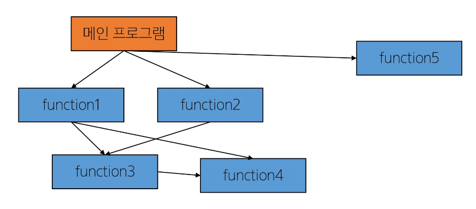
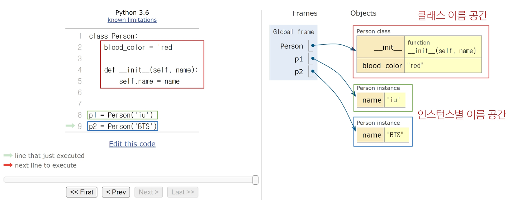

# 절차 지향 프로그래밍
- 프로그램을 '데이터'와 '**절차**'로 구성하는 방식의 프로그래밍 패러다임
- "데이터"와 해당 데이터를 처리하는 "함수(절차)"가 분리
    - 함수 호출의 흐름이 중요
- 코드의 순차적인 흐름과 함수 호출에 의해 프로그램이 진행
- 데이터를 다시 재사용 하기보다는 처음부터 끝까지 실행되는 결과물이 중요한 방식


## 소프트웨어 위기 (Software Crisis)
- 하드웨어의 발전으로 컴퓨터 계산용량과 문제의 복잡성이 급격히 증가함에 따라 소프트웨어에 발생한 충격
    - 이에 대한 해결책으로 객체 지향 프로그래밍 부상

# 객체 지향 프로그래밍
- 데이터와 해당 데이터를 조작하는 메서드를 하나의 객체로 묶어 관리하는 방식의 프로그래밍 패러다임
- 객체 간 상호작용과 메시지 전달이 중요

> **절차 지향과 객체 지향은 대조되는 개념이 아니다.**
>
> 객체 지향은 기존 절차 지향을 기반으로 두고 보완하기 위해 객체라는 개념을 도입해 상속, 코드 재사용성, 유지보수성 등의 이점을 가지는 패러다임이다.
>
> 파이썬에서도 함수 정의를 절차 지향적으로 할 수 있지만 동시에 클래스를 선언하여 객체 지향 프로그래밍을 할 수 있다.
>
> 항상 같이 간다는 것을 생각하자.

## 클래스
- 파이썬에서 타입을 표현하는 방법
    - 예를 들어 문자열 'a'는 `str`이라는 클래스로 만들어진 문자열이고 이 `str`이라는 클래스 안에는 `.capitalize`, `.title` 등등의 메서드가 포함되어 있는 것
- 객체를 생성하기 위한 설계도
- 데이터와 기능을 함께 묶는 방법을 제공
- 뒤에서 더 자세히 다룰 예정

## 객체
- 클래스에서 정의한 것을 토대로 메모리에 할당된 것
- **속성**과 **행동**으로 구성된 모든 것
    - 속성 = 변수 / 행동 = 메서드

## 인스턴스
- 클래스의 속성과 행동을 기반으로 생성된 개별 객체

> 특정 클래스로 만들어진 객체를 인스턴스라고 한다. 그리고 파이썬에서는 모든 객체가 인스턴스이기 때문에 사실상 `객체=인스턴스`라고 생각해도 문제가 없다.
>
> 다만 인스턴스를 그냥 인스턴스라고 하지 않고 클래스까지 이야기를 해주는 이유는 파이썬에서는 모든 게 다 인스턴스이기 때문에 인스턴스만 말할 경우 명시성이 떨어져 해당 인스턴스를 만든 클래스까지 언급을 해줘야 하는 것이다.


# 클래스

## 정의
- 클래스 이름은 파스칼 케이스(Pascal Case) 방식으로 작성
    - 파스칼 케이스: 변수의 단어 첫글자를 항상 대문자로 설정하는 것
    - 다른 변수나 함수와 구분하기 위함

## 구조
```python
class Person:
    blood_color = 'red'  # 변수
    
    def __init__(self, name):  # 메서드 
        self.name = name
    
    def singing(self):  # 메서드
        return f'{self.name}가 노래합니다.'
```
- 클래스는 크게 **변수** 와 **메서드**로 구조를 구분할 수 있다.

## 변수
### 클래스 변수
- 클래스 내부에 선언된 변수
- 클래스로 생성된 모든 인스턴스들이 공유하는 변수
- 동일한 클래스로 선언한 인스턴스들은 모두 동일한 클래스 변수를 가진다.
### 인스턴스 변수
- 특정 인스턴스에 한해서 선언한 변수
- 인스턴스가 선언할 때마다 초기화되고 해당 인스턴스에 맞게 변수 할당이 된다.

```python
class Circle:
    pi = 3.14  # 클래스 변수

    def __init__(self, r):
        self.r = r  # 인스턴스 변수

c1=Circle(5)
c2=Circle(10)

print(c1.r)  # 5
print(c2.r)  # 10
print(c1.pi)  # 3.14
print(c2.pi)  # 3.14

c1.pi=100  # c1의 인스턴스 변수 pi를 생성(변경)

print(Circle.pi)  # 3.14
print(c1.pi)  # 100
print(c2.pi)  # 3.14

Circle.pi=3  # 클래스 변수 변경

print(Circle.pi)  # 3
print(c1.pi)  # 100
print(c2.pi)  # 3
```
위에서 마지막에 클래스 변수 pi가 3으로 변경이 되어 Circle.pi와 c2.pi가 모두 3으로 변경이 되었다. 그러나 c1.pi가 여전히 100인 이유는 위에서 인스턴스 변수를 선언했기 때문이다.

파이썬에서는 변수를 찾을 때 우선적으로 **인스턴스 이름 공간**에서 변수를 먼저 찾고 없다면 **클래스 이름 공간**으로 넘어가서 변수를 찾기 때문에 이런 일이 발생한다.

### 인스턴스와 클래스 간 이름 공간
- 클래스를 정의하면 클래스와 해당하는 이름 공간이 생성
- 인스턴스를 만들면 인스턴스 객체가 생성되고 **독립적인** 이름 공간 생성

- 인스턴스에서 특정 속성에 접근하면 ``인스턴스->클래스`` 순으로 탐색한다.
- 전에 배웠던 scope와 비슷하게 생각하면 될 듯

## 메서드
- 인스턴스 메서드, 클래스 메서드, 정적 메서드

### 인스턴스 메서드 
- 클래스로부터 생성된 각 인스턴스에서 호출할 수 있는 메서드
- 인스턴스의 상태를 조작하거나 동작을 수행
- **반드시 첫 번째 매개변수로 인스턴스 자신(self)을 전달받는다.**
> 객체 지향 프로그래밍에서는 변수가 메서드를 호출해서 코드를 동작한다고 생각한다.
>
> 예를 들어 다음과 같은 코드가 있다.
> 
> `'hello'.upper()` (객체 지향)
> 
> 이 코드는 str 클래스로 정의된 'hello'라는 인스턴스를 str 클래스 내부의 upper 메서드를 이용하는 코드이다.
>
> 하지만 실제 파이썬 내부 동작은 다음과 같이 진행된다.
>
> `str.upper('hello')` (절차 지향)
>
> str 클래스가 upper 메서드를 호출했고 그 인자로 'hello'라는 인스턴스가 들어간 것
>
> 즉 모든 인스턴스는 인스턴스 메서드를 호출할 때마다 자기 자신이 인자로 들어가야 한다.
>
> 이게 바로 인스턴스 메서드의 첫 번째 매개변수가 반드시 인스턴스 자기 자신인 이유이다.
>
> 그러나 객체 지향 방식으로 표현할 경우 인스턴스가 맨 앞에 튀어나와서 헷갈리는 것이다.

#### 생성자 메서드
- 인스턴스 객체가 생성될 때 자동으로 호출되는 메서드
    - 매직 메서드 (뒤에서 다룰 예정)
- 인스턴스 변수들의 초기값을 설정한다.
- 얘도 인스턴스 메서드의 한 종류이다.

#### 예시
```python
class Person:
    def __init__(self, name):  # 생성자 메서드
        self.name=name
        print('인스턴스가 생성되었습니다.')
    
    def greeting(self):
        print(f'안녕하세요. {self.name}입니다.')

person1=Person('지민')  # 인스턴스가 생성되었습니다.
person1.greeting()  # 안녕하세요. 지민입니다.
# Person.greeting(person1)도 동일한 결과 (절차 지향적 표현)
```

### 클래스 메서드
- 클래스가 호출하는 메서드
- 클래스 변수를 조작하거나 클래스 레벨의 동작을 수행
- `@classmethod 데코레이터`를 사용하여 정의
    - 데코레이터: 다른 함수의 코드를 유지한 채로 수정하거나 확장하기 위해 사용되는 함수
- 반드시 첫 번째 매개변수로 자기 자신(cls)을 전달받는다.

#### 예시
```python
class Person:
    count = 0

    def __init__(self, name):
        self.name = name
        Person.count += 1
    
    @classmethod
    def number_of_population(cls):
        print(f'인구수는 {cls.count}입니다.')


person1 = Person('iu')
person2 = Person('BTS')

Person.number_of_population()  # 인구수는 2입니다.
```

### 스태틱(정적) 메서드
- 클래스와 인스턴스와 상관 없이 독립적으로 동작하는 메서드
- 주로 클래스와 관련이 있지만 인스턴스와 상호작용이 필요하지 않은 경우에 사용
- `@staticmethod 데코레이터`를 사용하여 정의
- 호출 시 필수적으로 작성해야 할 매개변수가 없다.
    - 단지 기능(행동)만을 위한 메서드로 사용

#### 예시
```python
class StringUtils:

    # 클래스에서 생성자 메서드를 안 쓰면 자동으로 알아서 붙여서 실행한다.
    # 하지만 써주는게 좋다.

    @staticmethod
    def reverse_string(string):
        return string[::-1]
    
    @staticmethod
    def capitablize_string(string):
        return string.capitalize()


text = 'hello, world'

reversed_text=StringUtils.reverse_string(text)
capitalized_text=StringUtils.capitablize_string(text)

print(reversed_text)  # dlrow ,olleh
print(capitalized_text)  # Hello, world
```

> 기본적으로 클래스 안에서 정의되는 메서드는 모두 인스턴스 메서드이다. 여기에 앞에 붙여주는 데코레이터의 유무, 종류에 따라 클래스 메서드인지 스태틱 메서드인지 달라지는 것이다.

> 클래스와 인스턴스는 모든 메서드를 호출할 수 있다.
>
> 그러나 **클래스는 클래스 메서드와 스태틱 메서드만, 인스턴스는 인스턴스 매서드만** 사용하도록 한다.

### 매직 메서드
- 인스턴스 메서드
- 특정 상황에 자동으로 호출되는 메서드

#### 예시
```python
class Circle:
    def __init__(self, r):
        self.r = r

    def __str__(self):
        return f'원의 반지름: {self.r}'


c1 = Circle(10)
c2 = Circle(1)

print(c1)  # 원의 반지름: 10
print(c2)  # 원의 반지름: 1
```

