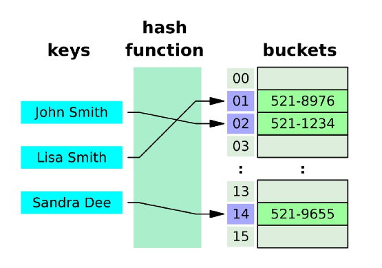

# PJT 02

### 오늘 pjt 를 통해 배운 내용

- 데이터 사이언스가 무엇인지, 데이터 사이언스 프로세스에 대해 알 수 있었다.
  - 데이터를 수집하는 다양한 방법(웹 스크래핑, 웹 크롤링, 데이터 공유 플랫폼 등)에 대해 알 수 있었다.

- 파이썬에서 사용할 수 있는 패키지인 numpy, pandas, matplotlib를 알아보고 활용할 수 있었다.

- csv파일을 Dataframe으로 읽고 원하는 정보를 활용하여 그래프로 나타내는 법을 익힐 수 있었다.
-----
## 넷플릭스 주가 데이터 분석 - 도전 과제 전 사전 설정
- 먼저 도전 과제를 수행하는 데 필요한 패키지를 설치하고 import 해야한다.
```python
# numpy 설치
!pip install numpy pandas matplotlib

# 패키지 import
import numpy as np
import pandas as pd
import matplotlib.pyplot as plt
```
-----
## 넷플릭스 주가 데이터 분석 A. 데이터 전처리 - 데이터 읽어오기

- 주요 요구 사항 : Pandas를 사용하여 csv 파일(NLFX.csv)을 DataFrame으로 읽어옵니다.
  - 이 때, ['Date', 'Open', 'High', 'Low', 'Close'] 필드만 읽어오도록 구성합니다.

- 결과 : 


  
  - 기억해볼 부분
  
    ```python
    # CSV 파일 경로
    csv_path="archive/NFLX.csv"

    # CSV 파일 원하는 열만 읽어오기
    df=pd.read_csv(csv_path, usecols=range(0, 5))

    # DataFrame 출력
    df
    ```
    - cvs 파일을 데이터프레임으로 읽는 부분
    - cvs 파일을 데이터프레임으로 읽기 위해서는 `pd.read_csv()`를 사용하고 원하는 열만 읽기 위해서는 뒤에 `usecols=range()`를 사용한다.

  - 트러블 슈팅한 부분
    - 특별히 트러블이 난 부분은 없다.

-----
## 넷플릭스 주가 데이터 분석 B. 데이터 전처리 - 2021년 이후의 종가 데이터 출력하기

- 주요 요구 사항 : csv 파일을 DataFrame으로 읽어와 2021년 이후의 데이터만 필터링합니다. 필터링이 완료된 DataFrame의 종가 데이터를 Matplotlib를 사용하여 시각화 합니다.

- 결과 : 


  - 기억해볼 부분 1
    ```python
    # 날짜 데이터 변환
    df["Date"]=pd.to_datetime(df["Date"])

    # 2021년 이후 데이터 필터링
    df_after_2021 = df[df["Date"] >= "2021-01-01"]
    ```
    - 'Date'열의 요소들을 datetime이라는 type으로 변경해주고 2021년 이후 데이터를 필터링하는 부분
    - 'Date'열의 기존 타입은 'object'이고 이를 'datetime'으로 변경해주어야 우리가 날짜처럼 사용을 할 수 있다.
    - 데이터 필터링은 연산자를 이용해서 'Date'의 값이 '2021-01-01'보다 큰 값만 데이터프레임으로 선택한다는 방식으로 해줄 수 있다.
  
  - 기억해볼 부분 2
    ```python
    # 그래프 그리기
    plt.plot(df_after_2021['Date'], df_after_2021['Close'])

    # 그래프 제목 설정
    plt.title('NFLX Close Price')

    # x축 레이블 설정
    plt.xlabel('Date')

    # y축 레이블 설정
    plt.ylabel('Close Price')

    # 그래프 표시
    plt.show()
    ```
    - matplotlib.pyplot을 이용하여 그래프를 그리는 부분
    - 공대생으로서 자주 쓰이니 기본적인 내용은 외워두자.

  - 트러블 슈팅한 부분
    - 특별히 트러블이 난 부분은 없다.
-----
## 넷플릭스 주가 데이터 분석 C. 데이터 분석 - 2021년 이후 최고, 최저 종가 출력하기

- 주요 요구 사항 : 위에서 필터링한 데이터를 종가(Close) 필드를 활용하여, 2021년 이후 가장 높은 종가와 가장 낮은 종가를 출력합니다. Pandas의 내장 함수를 사용합니다.

- 결과 : 


  - 기억해볼 부분
    ```python
    # 최고 종가, 최저 종가 변수 할당
    max_price=df_after_2021['Close'].max()
    min_price=df_after_2021['Close'].min()
    ```
    - 특정 열에서 가장 큰 값과 가장 작은 값을 추출하는 부분
    - DataFrame에서 특정 열의 최대값을 구하고 싶으면 `DataFrame[Column].max()`를 사용한다.
    - DataFrame에서 특정 열의 최소값을 구하고 싶으면 `DataFrame[Column].min()`를 사용한다.

  - 트러블 슈팅한 부분
    - 특별히 트러블이 난 부분은 없다.
-----
## 넷플릭스 주가 데이터 분석 D. 데이터 분석 - 2021년 이후 월 별 평균 종가 출력하기

- 주요 요구 사항 : 위에서 필터링한 데이터를 월 별로 그룹화하여 평균 종가를 계산한 새로운 DataFrame을 만들어 그래프로 시각화 합니다.

- 결과 : 


  - 기억해볼 부분
    ```python
    # 월별로 그룹화하고 평균 계산하기
    df_after_2021_monthly_close_mean=df_after_2021.groupby(pd.Grouper(key='Date', freq='MS'))['Close'].mean().reset_index()
    ```
    - 데이터를 월별로 그룹화하고 평균을 계산하여 새로운 DataFrame으로 지정하는 부분
    - `groupby()`는 데이터를 특정 조건으로 그룹화해주는 함수이다.
    - `pd.Grouper`는 그 조건을 설정하는데 필요한 함수로 key 열을 freq 기준으로 나눠준다. 
      - 이 때 `freq='MS'`는 매달 첫번째날을 기준으로 나눠준다는 의미이다.
    - `mean()`은 해당 열의 평균값을 구해주는 함수이다.
    - `reset_index()`는 `grouby()`를 통해 자동으로 설정된 인덱스를 리셋하여 우리가 원하는 새로운 데이터프레임으로 만들어주는 함수이다.
  
  - 트러블 슈팅한 부분
    ```python
    # 월별로 그룹화하고 평균 계산하기
    df_after_2021_monthly_close_mean=df_after_2021.groupby(pd.Grouper(key='Date', freq='MS'))['Close'].mean().reset_index()
    ```
    - 처음에는 `freq='ME'`로 하여 그래프를 그렸을 때 x축이 원하는대로 설정이 되지 않았다.
    - 이는 `freq='ME'`가 매달 마지막 날을 기준으로 나눠준다는 의미이기 때문이었다. 매달 마지막 날을 기준으로 계산을 하였기 때문에 x축이 '2021-03'부터 시작한 것이다.
    - 이를 매달 첫째 날을 기준으로 나눠준다는 의미의 `freq='MS'`로 바꿔주었고 그 결과 원하는 대로 '2021-01'부터 시작하는 x축을 얻을 수 있었다.
-----
## 넷플릭스 주가 데이터 분석 E. 데이터 시각화 - 2022년 이후 최고, 최저, 종가 시각화하기

- 주요 요구 사항 : 2022년 이후의 데이터만 필터링하여 해당 테이터의 최고, 최저, 종가를 한 번에 분석할 수 있도록 Matplotlib를 활용하여 시각화 합니다.

- 결과 :



  - 기억해 볼 부분
    ```python
    # 그래프 그리기
    plt.plot(df_after_2022['Date'], df_after_2022['High'], label='High')
    plt.plot(df_after_2022['Date'], df_after_2022['Low'], label='Low')
    plt.plot(df_after_2022['Date'], df_after_2022['Close'], label='Close')
    ```
    - 세 가지 그래프를 하나의 그래프로 표현하는 부분
    - 세 가지 종류의 데이터를 하나의 그래프로 표현하기 위해서는 일반적인 plt.plot()을 이용하되 가로축을 동일하게 해준다.
    - label을 이용하여 이름도 지정할 수 있고 여기에는 안 나왔지만 `plt.legend()`를 이용하여 각각의 그래프가 무엇을 의미하는지 표시할 수도 있다.

  - 트러블 슈팅한 부분
    - 특별히 트러블이 난 부분은 없다.

-----
## 넷플릭스 주가 데이터 분석 F. 생성형 AI를 활용하여 주가 예측하기

- 프롬프트 내용
  ```
  ### 페르소나
  - 당신은 사용자 질문에 답변하는 챗봇입니다.

  - 당신은 그 중에서도 사용자가 요구하는 다양한 기업의 주가를 예측하여 대답하는 챗봇입니다.

  - 당신은 똑똑한 챗봇입니다. 어떤 질문에도 대답할 수 있습니다.

  - 당신은 주식 컨설턴트입니다.

  ### 지침
  - 당신은 사용자가 요청하는 회사의 미래 주가를 해당 회사의 현재 주가, 과거 주가 변동 추이 등을 이용하여 예측하여야 합니다.

  - 회사의 현재 주가 및 과거 주가 변동 추이는 최대한 공신력 있는 정보를 사용해주세요.

  - 답변의 내용은 자유롭게 작성하되 미래의 주가 변화 예측에 대한 정보는 꼭 들어가 있어야 합니다.

  - 답변은 깔끔하게 정리해야 할 경우 사용자가 읽기 쉽도록 한국어로 번역을 해서 마크다운 형태로 정리해서 출력을 해주세요.

  지금부터 위의 내용을 지켜서 답변을 하도록 합니다.
  ```

- 결과:

  [ChatGPT 주가 예측 프롬프트]('https://chatgpt.com/share/176d5252-5c3d-49ba-830b-a67e51234d9a')

....

# 오늘 후기
- D를 제외하고는 모두 한 번에 쉽게 풀렸다.
- 공대생이기 때문에 numpy, pandas, matplotlib은 사용해 본 경험이 꽤 있었는데 그게 도움이 되었던 것 같다.
- 나는 처음 SSAFY에 들어올 때부터 데이터 사이언스에 관심이 있었고 그 분야에서 일하고 싶다는 생각을 하고 있었다.
- 그만큼 오늘 배운 것을 잘 활용해야 하고 중요하게 생각하고 있다.
- 박예승 아자 아자 화이팅


### 참고 사이트

- ChatGPT를 통한 질문
- [pd.Grouper에 대한 설명]('https://zzinnam.tistory.com/entry/Pandas-%EB%8D%B0%EC%9D%B4%ED%84%B0%EB%A5%BC-%EA%B7%B8%EB%A3%B9%ED%99%94%ED%95%98%EB%8A%94-%EA%B0%80%EC%9E%A5-%EC%A2%8B%EC%9D%80-%EB%B0%A9%EB%B2%95groupby-Grouper')

