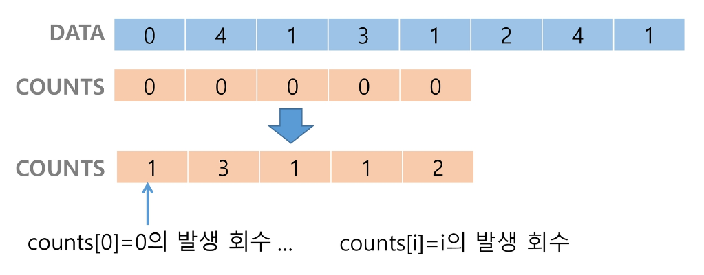
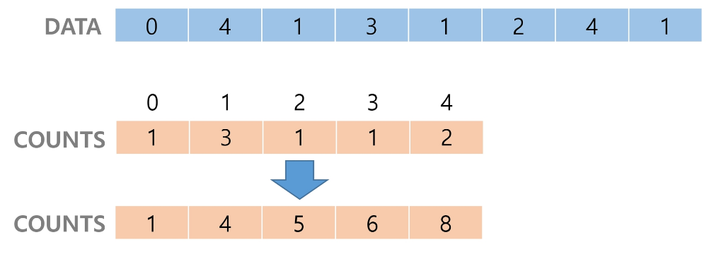
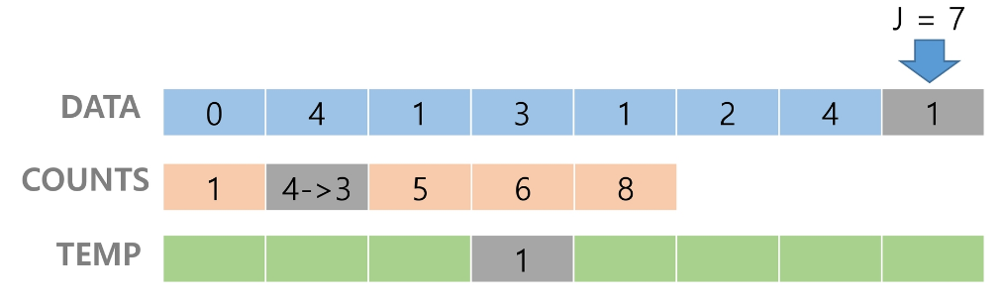
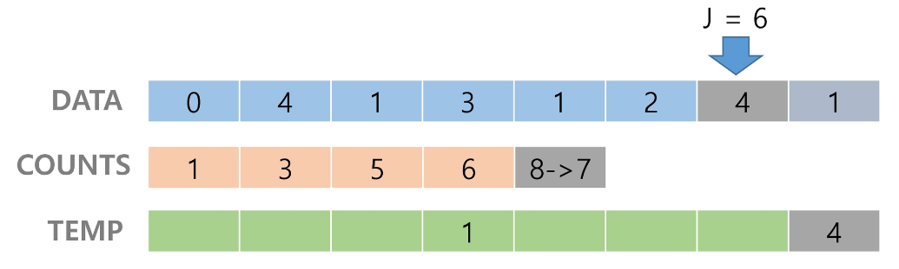
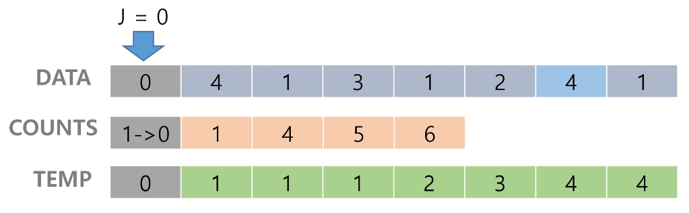

## 카운팅 정렬 (Counting Sort)
- 항목들의 순서를 결정하기 위해 집합에 각 항목이 몇 개씩 있는지 세는 작업이 필요
- 선형 시간에 정렬하는 효율적인 알고리즘
- **정수나 정수로 표현할 수 있는 자료**에 대해서만 적용 가능하다.
    - 각 항목의 발생 회수를 기록하기 위해 정수 항목으로 인덱스 되는 카운트의 배열을 사용하기 때문이다.
- 카운트들을 위한 충분한 공간을 할당하기 위해 집합 내의 가장 큰 정수를 알아야 한다.
- O(n+k)의 시간 복잡도 (n: 리스트 길이, k: 정수의 최댓값)
    - n이 비교적 작을 때만 가능하다.

### [0, 4, 1, 3, 1, 2, 4, 1]을 카운팅 정렬하는 과정

#### 1단계
- data에서 각 항목들의 발생 횟수를 세고, 정수 항목들로 직접 인덱스 되는 카운트 배열 counts에 저장한다.

```python
N=8    # data의 원소의 개수
data = [0, 4, 1, 3, 1, 2, 4, 1]
counts=[0]*5    # data의 최댓값+1 만큼의 길이

for num in data:
    counts[num]+=1  # 각 항목의 발생 회수를 세고 counts에 저장하기
```

#### 2단계
- 정렬된 집합에서 각 항목의 앞에 위치할 항목의 개수를 반영하기 위해 counts의 원소를 조정한다.

```python
for i in range(1, 5):
    counts[i]+=counts[i-1]  # 개수 누적하기
```

#### 3단계
- 리스트의 맨 마지막 요소부터 정렬을 시작한다.
    - 뒤에서부터 하는 이유는 순서가 유지되는 정렬이 가능하기 때문이다.
- 정렬된 리스트를 담기 위한 temp라는 리스트를 만들어 준다.
- data[7]의 값이 1이므로 counts[1]에 해당하는 값을 1 감소시킨 후 그 값에 해당하는 인덱스로 temp에 값을 추가해준다.
- 이게 뭔 말이냐면... 그냥 마음으로 느끼자... 난 이해하긴 했어...
- 하나씩 앞으로 오면서 정렬한다.



....



```python
temp=[0]*N

for i in range(N-1, 0, -1):
    counts[data[i]]-=1
    temp[counts[data[i]]]=data[i]

print(temp)    # [0, 1, 1, 1, 2, 3, 4, 4]
```

> 카운트 정렬의 기본적인 원리는 작은 수부터 개수를 누적해서 쌓아간다면 적어도 여기에는 위치해야된다... 라는 형식으로 정렬하는 것이다. 이게 무슨 말이냐면... 그냥 느끼자...

#### 코드 종합
```python
N=8

data=[0, 4, 1, 3, 1, 2, 4, 1]

counts=[0]*5

for num in data:
    counts[num]+=1 # data의 각 요소의 개수를 counts 리스트에 할당

for i in range(1, 5):
    counts[i]+=counts[i-1] # 개수 누적하기 # counts의 마지막 요소는 data의 요소 개수

temp=[0]*N

for i in range(N-1, 0, -1): # 뒤에서부터 하는 이유는 원래 순서가 유지 되는 정렬이 가능하기 때문에
    temp[counts[data[i]]-1]=data[i]
    counts[data[i]]-=1

print(temp)
```
# Baby-gin Game
- 0~9 사이의 숫자 카드에서 임의의 카드 6장을 뽑아쓸 때
    - run: 3장의 카드가 연속적인 번호를 갖는 경우
    - triplet: 3장의 카드가 동일한 번호를 갖는 경우
    - baby-gin: 6장의 카드가 run과 triplet으로만 구성된 경우
- baby-gin은 run과 triplet이 합쳐서 2개가 나오면 된다!
- 6자리의 숫자를 입력받아 baby-gin 여부를 판단하는 방법은?

## 완전 검색
- 문제의 해법으로 생각할 수 있는 모든 경우의 수를 나열해보고 확인하는 기법
- Brute-force 또는 generate-and-test 기법
- 모든 경우의 수를 테스트한 후 최종 해법 도출
    - 따라서 경우의 수가 상대적으로 작을 때 유용

### 완전 검색을 활용한 Baby-gin 접근
- 고려할 수 있는 모든 경우의 수를 생성하여 앞의 3자리와 뒤의 3자리를 잘라 run과 triplet 여부 테스트하기
    - 모든 경우의 수는 순열을 활용해서 생성할 수 있다.
    ```python
    # {1, 2, 3}을 포함하는 모든 순열을 생성하는 함수

    for i1 in range (1, 4):
    for i2 in range(1, 4):
        if i2 != i1:
            for i3 in range(1, 4):
                if i3 != i1 and i3 != i2:
                    print(i1, i2, i3)
    ```
    간단한 순열은 이렇게 나타낼 수 있지만 복잡해지면 다른 방식을 사용해야 한다.

## 탐욕(Greedy) 알고리즘
- 최적해를 구하는 데 사용되는 근시안적인 방법
- 순간 순간에 최적이라고 생각되는 것을 선택해 나가는 방식으로 진행
- 다음과 같은 기본적인 동작 과정을 갖고 있다.
    1. 해 선택: 현재 상태에서 부분 문제의 최적 해를 구한 뒤, 이를 부분해 집합에 추가한다.
    2. 실행 가능성 검사: 새로운 부분해 집합이 실행 가능한지를 확인한다. 또한 문제의 제약 조건을 위반하지 않는지 검사한다.
    3. 해 검사: 새로운 부분해 집합이 문제의 해가 되는지를 확인한다. 해가 되지 않는다면 다시 1로 돌아간다.

### 탐욕 알고리즘을 활용한 Baby-gin 접근
- 각 자리 숫자의 개수를 확인한 후 run과 triplet을 순서대로 조사하여 baby-gin 판별
- 판별은 run 조사 후 run 데이터 완전 삭제, triplet 조사 후 triplet 데이터 완전 삭제 의 방식으로 진행한다.

#### 코드
```python
num = 456789    # Baby-gin 확인할 6자리 수
c=[0]*12    # 개수 누적 리스트  # 가장 큰 정수는 9인데 12개의 배열을 생성하는 이유는 혹시 모르니까...

for i in range(6):
    c[num%10]+=1    # num을 리스트로 지정하지 않았기 때문에 이런 식으로 일의 자리 숫자부터 확인을 해준다.
    num //= 10

i=0
tri=run=0

while i<10:
    if c[i]>=3: # triplete 조사 후 데이터 삭제
        c[i]-=3
        tri+=1
        continue
    if c[i]>=1 and c[i+1]>=1 and c[i+2]>=1:
        c[i]-=1
        c[i+1]-=1
        c[i+2]=-1
        run+=1
        continue
    i+=1

if run + tri == 2:
    print("Baby Gin!")
else:
    print("Lose")
```