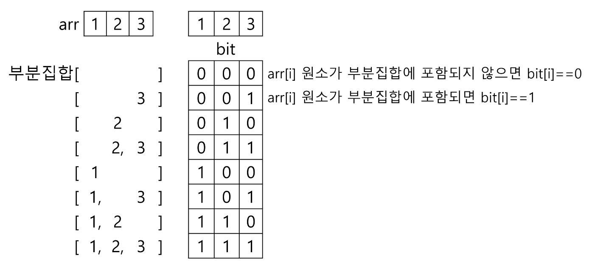

# 2차원 배열
- 1차원 리스트의 요소로 1차원 리스트가 들어간 리스트
- 세로 길이(행의 개수)와 가로 길이(열의 개수)를 필요로 한다.

> 2차원 배열을 입력받아 생성하는 방법
>
> input: 3, 1 2 3, 4 5 6, 7 8 9
> 
> ```python
> N = int(input())  # 3
> arr = [list(map(int, input().split())) for _ in range(N)]
> '''
> [[1, 2, 3],
>  [4, 5, 6],
>  [7, 8, 9]]
> '''
> ```

## 배열 순회
- n*m 배열의 원소를 빠짐없이 조사

### 행 우선 순회
```python
# i 행의 좌표
# j 열의 좌표
for i in range(n):
    for j in range(m):
        print(array[i][j])  # 필요한 연산 수행
```

### 열 우선 순회
```python
# i 행의 좌표
# j 열의 좌표
for j in range(m):
    for i in range(n):
        print(array[i][j])  # 필요한 연산 수행
```

### 지그재그 순회
```python
for i in range(n):
    for j in range(m):
        print(arr[i][j+(m-1-2*j)*(i%2)])
```
짝수행(i%2=0)에 대해서는 열을 순서대로 순회. 홀수행(i%2=1)에 대해서는 열을 반대로 순회하기 위해서 j+(m-1-2*j) 순서로 순회.

위의 방식이 어렵다면 if문을 사용해도 된다.
```python
for i in range(n):
    if i%2==0:
        for j in range(m):
            print(arr[i][j])
    else:
        for j in range(m-1, 0, -1):
            print(arr[i][j])
```
하지만 이렇게 하면 위의 공식보다 시간이 조금 더 걸린다는 문제가 있다. 그래도 이해하기 어려우면 if-else 쓰자.

## 델타를 이용한 2차 배열 탐색
- 2차 배열의 한 좌표에서 인접한 4방향의 인접 배열 요소를 탐색하는 방법

```python
arr=[[1, 2, 3],
     [4, 5, 6],
     [7, 8, 9]]

di = [0, 1, 0, -1]
dj = [1, 0, -1, 0]
# 이건 오른쪽 방향 번호를 0으로 하여 시계 방향으로 인접 배열 요소를 탐색하는 경우로 탐색하는 방향을 바꿀 경우 di와 dj도 바꿔야 한다.

for i in range(3):
    for j in range(3):
        for k in range(4):
            ni = i + di[k]
            nj = j + dj[k]
            if 0<=ni<3 and 0<=nj<3:
                print(arr[ni][nj], end=' ')

# 2 4 3 5 1 6 2 5 7 1 6 8 4 2 9 5 3 8 4 9 7 5 8 6
```

## 전치 행렬
- n*n 행렬해서 n행의 값을 n열의 값으로 옮긴 행렬
- 대각 방향의 요소들의 위치를 서로 바꿔주는 것이 기본적인 원리이다.

```python
# i 행의 좌표 (len(arr))
# j 열의 좌표 (len(arr[0]))
arr = [[1, 2, 3],
       [4, 5, 6],
       [7, 8, 9]]

for i in range(3):
    for j in range(3):
        if i<j:
            arr[i][j], arr[j][i] = arr[j][i], arr[i][j]
# 대각선의 오른쪽 위에 위치한 원소들을 왼쪽 아래에 위치한 원소들과 위치를 바꾸는 과정

print(arr)
'''
[[1, 4, 7],
 [2, 5, 8],
 [3, 6, 9]]
'''
```

### i. j의 크기에 따라 접근하는 원소

왼쪽 아래로 향하는 대각선의 경우 N(원소의 크기)-i==j 인 경우이다.

## 연습 문제
### 연습문제 1-1
```python
N = int(input())    # 이차원 리스트의 크기
arr = [list(map(int, input().split())) for _ in range(N)]    # 이차원 리스트 생성

s = 0    # 합이 담길 변수

for i in range(N):
    for j in range(N):
        if i == j or N-1-i == j:    # 대각선 방향의 요소들만 순회
            s += arr[i][j]    # 대각선 방향의 요소들을 더해주기

# 정 가운데 요소가 중복되는 것을 고려해주지 않아도 되는 이유는
# 위에서 i == j 또는 N-1-i == j라고 하였기 때문에
# 이 둘을 모두 만족시키는 가운데 요소는 한 번만 고려가 된다.

print(s)
```

### 연습문제 1-2
```python
N = int(input())
arr = [list(map(int, input().split())) for _ in range(N)]

di = [0, 1, 0, -1]
dj = [1, 0, -1, 0]

total_sum = 0

for i in range(N):
    for j in range(N):
        element_sum = 0
        for k in range(4):
            ni = i + di[k]
            nj = j + dj[k]
            if 0 <= ni < N and 0 <= nj < N:
                difference = abs(arr[ni][nj]-arr[i][j])
                element_sum += difference
        total_sum += element_sum

print(total_sum)
```

# 부분집합
## 부분집합 생성하기
### 비트 연산자
- `&`: 비트 단위로 AND 연산을 한다.
- `|`: 비트 단위로 OR 연산을 한다.
- `<<`: 피연산자의 비트 열을 왼쪽으로 이동시킨다.
- `>>`: 피연산자의 비트 열을 오른쪽으로 이동시킨다.
### 비트 연산자를 이용한 부분집합 생성하기
```python
arr = [3, 6, 7, 1, 5, 4]
n = len(arr)
subset_list =[]

for i in range(1<<n):
    subset=[]
    for j in range(n):
        if i & (1<<j):
            subset.append(arr[j])
    subset_list.append(subset)

print(subset_list)
```
- `for i in range(1<<n)` 에서 1<<n은 2의 n제곱 (원소가 n개인 집합의 부분집합의 개수)이다.
- i라는 숫자를 비트로 전환했을 때 1이 나타나는 위치가 있을텐데 그 위치(인덱스)와 동일한 인덱스를 가진 집합의 원소가 i번째 부분집합의 원소가 되는 것이다.
    - i에서 1이 나타나는 위치를 찾기 위한 부분이 `if i & (1<<j)`
    - j가 range(n) 안에서 도는 이유는 i라는 숫자가 차지하는 비트의 개수가 최대 n개 이기 때문에 그 안에서만 체크하면 된다.

            
> 기본적인 원리는 집합 arr로 만들 수 있는 모든 부분집합의 개수만큼 for문을 돌리는 것이다. i번째 부분집합에 대해서 i를 비트로 전환하고 1이 나타나는 위치를 찾아 그 위치를 인덱스로 가지는 집합의 원소가 i번째 부분집합의 원소가 되는 것이다.
>
> 예를 들어 위의 예시에서 i가 5, 즉 6번째 부분집합(첫번째 부분집합은 i가 0인 경우)의 경우 i는 비트로 나타냈을 때 101이 되고 첫번째, 세번째에 1이 나타나므로 첫번째, 세번째로 나타나는 원소인 3과 7이 6번째 부분집합의 원소가 되는 것이다.
>
> 이 사진을 보면 조금 이해가 되긴 할거다.
> 
> 뭔가 이해가 되긴 하는데 코드는 사실... 아직 조금 더 수련이 필요할 것 같다.